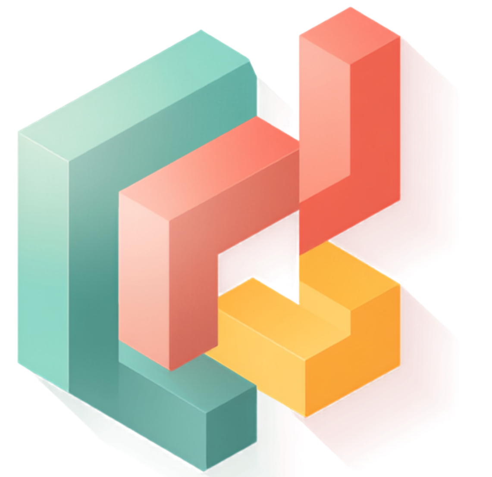

<p align="center">
  
</p>

<h1 align="center">Mocky</h1>

<p align="center">A self-hosted, chat-to-UI generator — describe a screen in natural language and get a real React + Tailwind component, live, on an infinite canvas.</p>

---

Mocky is a self-hosted alternative to tools like Google Stitch / openStitch, built around two ideas:

- **Ollama Cloud as a first-class provider** — a configurable base URL (default `https://ollama.com`) + API key sent as a Bearer token, so you own your model access.
- **A portable design system (`DESIGN.md`)** — plain Markdown (color tokens, typography, spacing, component patterns) that Mocky prepends to every generation so screens stay on-brand across sessions.

## Features

- 🧠 **Chat-to-UI generation** — describe a screen, get a self-contained React + Tailwind component.
- 🖼️ **Infinite canvas** — a Stitch-like dotted board; pan/zoom, real-size resizable frames, Windows-style multi-select (click / Ctrl-click / marquee), arrange-to-grid.
- ▶️ **Interact mode** — click buttons, hover states and animations run live, right in the grid.
- 🔗 **Interaction links + Demo mode** — bind a real element of one screen to another, then play the clickable prototype.
- 📱 **Format presets & device frame** — Mobile (iPhone) / Desktop / Tablet; mobile screens render inside a CSS iPhone frame (status bar, notch, home indicator).
- 🎨 **Design system + style presets** — load/paste a `DESIGN.md` or pick a built-in visual style; it drives every generation.
- 📦 **Projects, export & history** — multiple projects, per-screen `.tsx` download and `.zip` export, all persisted locally.
- 🌗 **Themes** — Dark, Beige, and a Mocky (teal) light theme.

## Tech stack

React 18 · TypeScript · Vite · Tailwind CSS. No backend — everything runs in the browser, with a small dev-only Vite proxy so the browser can reach the model provider without CORS issues.

## Getting started

```bash
npm install
npm run dev
```

Then open the app, go to **Settings**, and configure your provider:

1. **Provider** — Ollama Cloud
2. **Base URL** — `https://ollama.com` (or your own Ollama host)
3. **API key** — your Ollama Cloud key (stored only in your browser's `localStorage`)
4. **Model** — pick from the auto-loaded list (e.g. `gpt-oss:120b`)
5. **Test connection**, then head to **Studio** and describe a screen.

## How generation works

All traffic goes to the provider's `POST /api/chat` through a dev proxy:

- **New screen** — system prompt (output rules + `DESIGN.md` + format hint) + your description.
- **Edit a selected screen** — the same rules **plus the full current component code** and a strict "change only what's asked, preserve everything else" instruction. The model returns the complete updated component.

## Notes

- The API key never leaves your browser and is not committed anywhere.
- The provider proxy is a **dev-only** Vite middleware; a production deployment would need a small backend proxy to keep the key off the client.

---

<p align="center"><sub>Built with <a href="https://claude.com/claude-code">Claude Code</a>.</sub></p>
