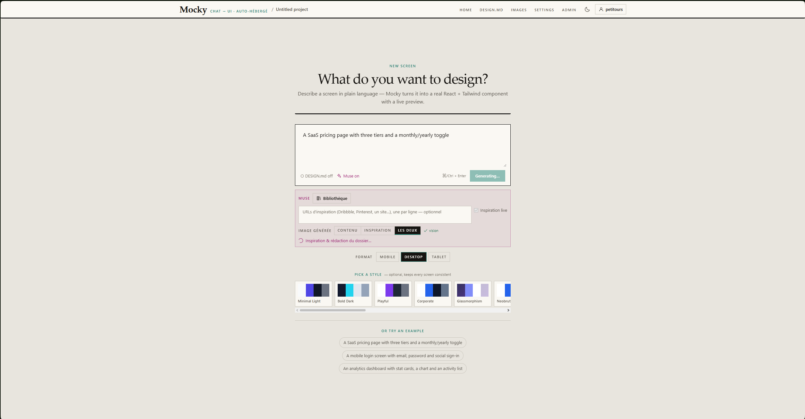

<p align="center">
  
</p>

<h1 align="center">Mocky</h1>

<p align="center">A self-hosted, chat-to-UI generator — describe a screen in natural language and get a real React + Tailwind component, live, on an infinite canvas.</p>

<p align="center">
  <a href="https://github.com/PetitOursManu/Mocky/actions/workflows/ci.yml"></a>
</p>

<p align="center">
  
</p>

<p align="center"><sub>Describe a screen, pick a format, and let ✨ Muse build the art direction. — <a href="docs/DESIGN-SYSTEM.en.md">design system</a></sub></p>

<p align="center"><strong>English</strong> · <a href="README.fr.md">Français</a></p>

---

> **Why it works this way —** Chat-to-UI tools normally run on someone else's servers with someone else's model, which means your prompts, your screens and your brand rules all leave your machine, and your access can be withdrawn without notice. Mocky inverts that arrangement: the model endpoint is a URL and a key you supply, the art direction is a Markdown file you keep, and the whole application runs from a container you start yourself.

Mocky is a self-hosted alternative to tools like Google Stitch / openStitch, built around two ideas:

- **Ollama Cloud as a first-class provider** — a configurable base URL (default `https://ollama.com`) + API key sent as a Bearer token, so you own your model access.
- **A portable design system (`DESIGN.md`)** — plain Markdown (color tokens, typography, spacing, component patterns) that Mocky prepends to every generation so screens stay on-brand across sessions.
- **Generation tuned for real UIs** — the system prompt forbids wireframes, gray placeholders, and "Lorem ipsum"; it asks for finished, interactive components with real copy, hover/focus states, and modern Tailwind styling.
- **Optional "Sign in with Dashy" SSO** — let users authenticate through a [Dashy](https://github.com/PetitOursManu/Dashy) instance and find their Mocky projects without another password.

## Features

> **Why it works this way —** Every entry below closes the same gap: a model can write JSX in seconds, but a screen only becomes useful once it has real copy, real colours, real interaction and somewhere to live. So this is not a catalogue of independent toys — the canvas, the runtime capabilities, Muse, the interaction links and the export are the successive steps that carry one sentence of description all the way to something you can click, show and hand over.

- 🧠 **Chat-to-UI generation** — describe a screen, get a self-contained React + Tailwind component.
- ✨ **Muse — design intelligence** — one toggle turns a prompt into a distinctive art direction with real copy, a coherent palette, and genuine generated imagery (see [✨ Muse](#-muse--design-intelligence) below). Grounded in live award-winning references via local MCP servers; zero keys required.
- 🎨 **Production-ready output** — the prompt enforces real colors, spacing, rounded corners, shadows, interactive states, and realistic content (no wireframes).
- 🖼️ **Infinite canvas** — a Stitch-like dotted board; pan/zoom, real-size resizable frames, Windows-style multi-select (click / Ctrl-click / marquee), arrange-to-grid.
- ▶️ **Interact mode** — click buttons, hover states and animations run live, right in the grid.
- ✦ **Real motion, safely** — eleven animation presets and three components behind a single `<Animated preset="…">` wrapper, powered by [Motion](https://motion.dev). The generating model never writes animation code: it picks a name from a closed list (see [Animations](#animations) below). One switch, per project or per screen, holds everything still.
- 🎞️ **Scroll-driven video** — Muse can generate (or you can import) a clip and let the visitor scrub through it with the scroll wheel, pinned full-height.
- 🖼️ **Media library** — every generated image and sequence in one place, plus **your own** images and clips. Muse builds its art direction *from* what you select.
- 🔗 **Interaction links + Demo mode** — bind a real element of one screen to another, then play the clickable prototype.
- 📱 **Format presets & device frame** — Mobile (iPhone) / Desktop / Tablet; mobile screens render inside a CSS iPhone frame (status bar, notch, home indicator).
- 🎨 **Design system + style presets** — load/paste a `DESIGN.md` or pick a built-in visual style (17 presets); it drives every generation.
- ✂️ **Screenshot annotations** — snip a region of a screen into the chat as numbered references, attached to (vision) generations.
- 📦 **Projects & export** — multiple projects, per-screen `.tsx` download, and a runnable Vite project as `.zip`.
- 👤 **Optional accounts + SSO** — sign in to a Mocky instance and your projects + DESIGN.md sync across devices (self-hosted backend, no cloud). With a [Dashy](https://github.com/PetitOursManu/Dashy) instance, users can also **"Sign in with Dashy"** and reuse their projects. Without an account everything stays in your browser's `localStorage`.
- 🌗 **Two themes** — Papier and Encre, both first-class: same tokens, neither patched on top of the other. Every pairing is checked against WCAG AA by a test that reads the real token file.

## Tech stack

> **Why it works this way —** Anything a self-hoster must install separately — a database, a native module, a background worker — is one more thing that can be missing, mismatched or left unpatched on their machine, and Mocky is meant to start with a single command. So its state is plain files on disk, its backend is a small process, and the only program it expects to find outside itself is the one that handles video; when that is absent, a single feature reports itself unavailable and nothing else notices.

React 18 · TypeScript · Vite · Tailwind CSS on the front, and a tiny **Node + Express** backend (JSON file store, no database) for accounts, project sync, the media library, Muse, scroll sequences and the model proxy. [Motion](https://motion.dev) is vendored for the previews, and `ffmpeg` is the one external binary — it cuts a video into the frames a scroll sequence scrubs through, and everything else works without it.

## Quick start

> **Why it works this way —** Several of Mocky's routes spend real money — model calls, image generation, video frames — and its store holds work that belongs to named people, so the instance identifies its callers before it does anything at all, and the very first person to arrive is the one it hands the keys to. The two prerequisites below are alternatives rather than a list: the container image arrives with every optional part already inside it, while a source checkout expects you to supply the runtime yourself.

**Prerequisites:** Docker, *or* Node 20.19+ (see `.nvmrc`). Nothing else — no database, no native modules.

**Mocky requires an account.** The first one you create becomes the instance admin, and only an admin can add other users or configure an instance-wide model. There is no anonymous mode: projects, the image library and Muse all live behind a session.

### Docker (recommended)

> **Why it works this way —** The image is the recommended path because every optional part is already inside it — the video tool, and the headless browser Muse uses to look at live references — so nothing quietly degrades on a machine that happens to lack them. Its port binding is the more interesting default: a container published on every interface is reachable by anything else on the network, and this is an application whose buttons cost money to press, so the mapping starts on the loopback address and widening it has to be typed out on purpose.

```bash
git clone https://github.com/PetitOursManu/Mocky.git
cd Mocky
docker compose up -d --build
```

Mocky is live on **http://localhost:8787**. Data (accounts, projects, sessions, generated images) persists in the `mocky-data` Docker volume.

> The port is published on `127.0.0.1` only, so the instance is not reachable from your network. Several routes spend your model credits, so that is the safe default. To expose it deliberately, set `MOCKY_BIND=0.0.0.0` in `.env` — and read [Reverse proxy / HTTPS](#reverse-proxy--https) first.

| Command | Description |
|---|---|
| `docker compose up -d --build` | Build image and start in background |
| `docker compose logs -f` | Follow logs |
| `docker compose ps` | Status, including the health check |
| `docker compose down` | Stop and remove container (data preserved in the volume) |
| `docker compose down -v` | Stop and **delete all data** (volume removed) |

### Local development

> **Why it works this way —** Two processes exist because they do unrelated jobs: one compiles and hot-reloads the interface as you edit it, the other owns everything that has state. Running only the first therefore produces an application that renders perfectly and can never let you in, which is why the combined command is the recommendation rather than a convenience.

```bash
npm install
npm run dev:all        # Vite + backend together — this is the one you want
```

Then open **http://localhost:5173**.

> `npm run dev` starts the **web server only**, with no backend. Since Mocky needs an account and accounts live on the backend, the sign-in box will tell you it cannot reach it. Use `dev:all` unless you specifically want the frontend alone.

**Production build:**

```bash
npm run build          # builds the frontend to dist/
npm start              # backend serves dist/ + API + model proxy on :8787
```

### First run

> **Why it works this way —** An instance with no accounts has nobody who could grant the first administrator its rights, so the rule is positional — whoever registers first receives them — and nothing downstream can undo that, which is why the warning about the credentials is not decorative. Only one of the two model configurations can be in force at a time, and the reason is accounting: an admin-configured key is spent by the server on everyone's behalf, so a per-browser key still active beside it would make it impossible to say whose credits a generation just consumed.

1. Open Mocky. The sign-in box appears and **cannot be dismissed** — that is by design.
2. Create the first account. **It becomes the admin.** Keep the credentials; there is no password-reset flow, and promoting another account means editing `server/data/users.json` by hand.
3. Configure a model — two ways, and they are mutually exclusive:

   - **Per browser** (default) — **Settings** → provider `Ollama Cloud`, base URL `https://ollama.com`, your API key, then pick a model from the list and hit **Test connection**. The key is kept in that browser's `localStorage` and never reaches the server.
   - **Instance-wide** (admin) — **Admin** → *Modèle de texte*. The key is stored server-side and used for everyone; each user's own Settings are then greyed out. Pick this if you would rather not paste a key into every browser.

4. Describe a screen and generate. Turn on ✨ **Muse** for a full art direction with real copy and generated imagery — see [✨ Muse](#-muse--design-intelligence).

### Housekeeping

> **Why it works this way —** Each of these replaces something that used to be a documented one-liner and did not survive contact with reality: a shell backup recipe whose syntax has no equivalent on Windows, and a "trust the vendored bundles" policy with nothing actually checking them. Turning the first into a dependency-free script makes it behave the same on every operating system, and the second re-hashes each file against a recorded manifest — those bundles are minified, they execute beside model-generated code, and a few altered bytes in one would pass any human review.

```bash
npm run backup         # → backups/mocky-YYYY-MM-DD-HHmm.zip
npm run check:vendor   # verify the vendored browser bundles against their hashes
npm test               # the full suite
```

`npm run backup` is plain Node and works identically on Windows, macOS and Linux. For a Dockerised instance, copy the data out of the volume first:

```bash
docker compose cp mocky:/app/server/data/. ./server/data
npm run backup
```

## Docker deployment

> **Why it works this way —** A self-hosted instance is only as recoverable as its state is easy to find, so Mocky keeps all of it in one writable directory and treats the container itself as disposable: rebuild the image whenever you like, re-attach the same directory, and nothing is lost. Everything in this chapter follows from that single split between an image you can throw away and a directory you cannot.

### Architecture

> **Why it works this way —** The tools that turn typed source into a browser bundle are large, numerous, and needed exactly once. A two-stage build lets the first stage hold all of them while the second inherits only their output, so what ends up on the running machine is the compiled interface plus the handful of packages the server genuinely calls — a smaller image to move around, and less code sitting on something you have exposed to a network.

The Docker image is a **multi-stage build** based on `node:20-slim`:

- **Stage 1 (builder)**: installs all dependencies, runs `npm run build` → produces `dist/`
- **Stage 2 (runtime)**: installs only production dependencies, copies `dist/`, `server/`, and `public/` from the builder. Runs `node server/index.js`.

The Express server serves the built frontend, the `/api` endpoints (auth, data sync), and the `/__provider` proxy (SSRF-guarded reverse proxy to the model provider).

### Environment variables

> **Why it works this way —** A self-hosted tool that demands configuration before it will start is a tool most people never see running, so every setting here has a working default and the important choices are made in the interface instead. What is left in the table are the assumptions those defaults quietly encode — where the state is kept, whose address a request appears to come from, what Mocky's public URL is — and each of them stays correct right up until you put something else in front of the server.

All environment variables are **optional**. Mocky runs out of the box: accounts are created from the sign-in screen and the model provider is configured in the UI.

| Variable | Default | Description |
|---|---|---|
| `PORT` | `8787` | Port the Express server listens on. **Source installs only** — under Docker the compose file pins it, and the host-side port is the left-hand number in `ports:` |
| `MOCKY_PORT` | _(unset)_ | Overrides `PORT` for the backend. Useful in dev: a tool that injects `PORT` to configure Vite won't push the backend onto Vite's port. Leave unset in production and use `PORT` |
| `MOCKY_HOST` | `127.0.0.1` | **Source installs** — which interface the server itself listens on. Loopback by default, so `npm start` does not put an instance with open sign-ups on your network. Set `0.0.0.0` to reach it from another machine. The Docker image sets `0.0.0.0` and you should leave it alone: a container listening on loopback cannot be reached through its published port |
| `MOCKY_BIND` | `127.0.0.1` | **Docker only** — the host interface the container publishes on. `0.0.0.0` exposes Mocky to your network; do that only on a network you trust, or behind a reverse proxy |
| `MOCKY_DATA_DIR` | `server/data` | Where the JSON store lives. Point it at a mounted volume to keep state outside the app directory. **Do not set it under Docker** — the volume is already mounted at `/app/server/data`, and changing the path moves your state back out of it |
| `TRUST_PROXY` | _(unset)_ | Set to `1` (or a hop count, or an Express `trust proxy` value) **when Mocky sits behind a reverse proxy**. Without it every request looks like it comes from `127.0.0.1`, so the login rate limit becomes a single instance-wide bucket — nine failed attempts a minute and nobody can sign in. Also required for the fail2ban jail in `deploy/fail2ban/` to ban real clients rather than your proxy |
| `MOCKY_MAX_STORAGE_MB` | `10240` | Ceiling on the media libraries (images + scroll sequences). Past it, uploads and generations answer `507` with a clear message. Without a ceiling one account can write ~4 GB/min through video uploads, and a full volume also stops accounts, sessions and projects from being saved — silently, because the stores swallow their write errors. `0` disables the limit |
| `NODE_ENV` | `production` | Enables optimised serving. Cookie security is derived from the actual connection, not from this |
| `SSO_SHARED_SECRET` | _(unset)_ | HS256 secret shared with Dashy for SSO. Must match Dashy's `SSO_SHARED_SECRET`. Together with `SSO_DASHY_URL`, enables "Sign in with Dashy" |
| `SSO_DASHY_URL` | _(unset)_ | Public origin of your Dashy instance (e.g. `https://dashy.example.com`) |
| `MOCKY_ORIGIN` | _(unset)_ | Mocky's own public origin (e.g. `https://mocky.example.com`), used as the SSO token's `aud` claim and to build the callback URL. **Required for SSO** — without it SSO stays off and says so at boot. There is no fallback: the previous one read the caller's own `Host`/`Origin` header, which let the caller choose the audience it was checked against |

**Setting env vars in Docker.** `docker-compose.yml` reads a local `.env`:

```bash
cp .env.example .env
# edit .env, then:
docker compose up -d --build
```

The server also logs whether SSO came up at boot, so a typo in a variable name shows immediately:

```
Mocky backend on http://localhost:8787
SSO: disabled (set SSO_SHARED_SECRET and SSO_DASHY_URL in .env to enable)
```

You can equally hard-code values under `environment:` in `docker-compose.yml`.

### Volumes

> **Why it works this way —** Anything written inside a container disappears the moment that container is replaced, and replacing it is precisely what rebuilding does on every update. A named volume is a directory living outside the image that gets re-attached to each new container, so everything a user would grieve over survives an upgrade untouched — and disk planning should start from the video entry rather than from the JSON, since one sequence stores a clip together with the whole run of stills extracted from it.

| Volume | Mount point | Description |
|---|---|---|
| `mocky-data` | `/app/server/data` | JSON file store: accounts, sessions, per-user projects, the image library, and the scroll sequences (`video-library/`, which is by far the heaviest — a clip plus up to 150 frames each). Named volume in docker-compose — persists across container rebuilds |

**Backing up data.** Copy the volume out, then use the bundled script — it is plain Node, so it behaves the same on Windows, macOS and Linux:

```bash
docker compose cp mocky:/app/server/data/. ./server/data
npm run backup
```

To restore: stop Mocky, unzip the archive over `server/data`, copy it back and start again.

```bash
docker compose stop
```

```bash
docker compose cp ./server/data/. mocky:/app/server/data
```

```bash
docker compose start
```

> **The trailing `/.` is the whole command.** `docker cp` copies a source
> *directory* **into** an existing destination directory. Both ends exist here —
> the Dockerfile creates `/app/server/data` and the volume mounts over it, and
> `server/data` appears on your machine the first time you run Mocky from
> source. So without the `/.` you get `server/data/data/users.json`: the copy
> reports success, Mocky starts with no accounts and no projects, and nothing
> anywhere says why. With `/.` you copy the *contents*, which is what you meant.
>
> Use `docker compose stop`, not `down`. `down` deletes the container, and
> `docker compose cp` then fails with "no container found".

> The previous `docker run -v $(pwd):/backup alpine tar …` recipe does not work on Windows: `$(pwd)` is not `cmd.exe` syntax, and under PowerShell it expands to a path that may contain spaces, which breaks the `-v` argument.

The archive contains password hashes and session tokens — `backups/` is git-ignored, keep it that way.

### Ports

> **Why it works this way —** Everything the browser needs arrives from one listener, which is less about tidiness than about origins: a page and the endpoints it calls that share a single address need no cross-origin negotiation, no preflight, and no second hole in a firewall. Which host port you map it to is therefore free to change — inside the container the number stays where it is.

| Port | Protocol | Description |
|---|---|---|
| `8787` | HTTP | Express server (frontend + API + provider proxy) |

To change the exposed port, edit `ports` in `docker-compose.yml`:

```yaml
ports:
  - "3000:8787"    # expose on host port 3000
```

### Health check

> **Why it works this way —** A health check is only worth having if it is capable of failing. The container used to poll a configuration endpoint that answers out of memory, so an instance whose disk had turned read-only, or which had been started without ever being built, reported itself in perfect health while being entirely unusable. Probing the two conditions directly — and naming which one gave way — is what makes the status line worth reading at all.

`GET /api/health` reports on the two things that actually break a running instance:

```json
{ "ok": true, "checks": { "dataWritable": true, "frontendBuilt": true } }
```

It answers `503` with a `detail` string when either fails — a read-only data directory, or `npm start` without `npm run build`. The container health check polls it every 30 seconds.

```bash
docker compose ps     # shows health status
curl -s localhost:8787/api/health
```

### Reverse proxy / HTTPS

> **Why it works this way —** A reverse proxy is the last hop before the application, so unless told otherwise the server reads the proxy's own address as the caller's — and a limiter that counts failed logins per address then counts every visitor as the same person. `TRUST_PROXY` makes it read the forwarded address instead; `MOCKY_ORIGIN` supplies the public URL the server can no longer work out for itself once it is no longer the thing browsers connect to; and TLS terminates at the proxy because there is no certificate handling in the server at all.

Behind Nginx, Caddy or Traefik:

- **Set `TRUST_PROXY=1`.** Otherwise every request appears to originate from the proxy, and the login rate limit collapses into one bucket shared by everyone.
- **Set `MOCKY_ORIGIN`** to your public HTTPS URL — required if SSO is enabled.
- Keep `MOCKY_BIND=127.0.0.1` (the default) and let the proxy reach Mocky over the loopback interface.
- Terminate TLS at the proxy. The Express server does not handle it.

Generate the SSO shared secret without needing `openssl` (which is not on a standard Windows `PATH`):

```bash
node -e "console.log(require('crypto').randomBytes(48).toString('base64'))"
```

Example Caddyfile:

```
mocky.example.com {
    reverse_proxy localhost:8787
}
```

Example Nginx:

```nginx
server {
    listen 443 ssl;
    server_name mocky.example.com;

    location / {
        proxy_pass http://localhost:8787;
        proxy_set_header Host $host;
        proxy_set_header X-Real-IP $remote_addr;
        proxy_set_header X-Forwarded-For $proxy_add_x_forwarded_for;
        proxy_set_header X-Forwarded-Proto $scheme;
    }
}
```

## How generation works

> **Why it works this way —** Putting a hop of Mocky's own between the page and the model buys three things at once: the request leaves the browser same-origin, the destination can be examined before anything is dialled, and a single code path serves both a key that lives in your browser and a key configured for the whole instance. The two request shapes below differ only in what they carry, because an edit instruction that omits the component as it stands today is an open invitation for the model to rebuild the screen from memory.

All traffic goes to the provider's `POST /api/chat` through a reverse proxy:

- **New screen** — system prompt (output rules + `DESIGN.md` + format hint) + your description.
- **Edit a selected screen** — the same rules **plus the full current component code** and a strict "change only what's asked, preserve everything else" instruction. The model returns the complete updated component.

The model's response uses a **sentinel protocol** (`<<<MOCKY>>> ... <<<END>>>`) instead of markdown fences, so partial code can be extracted during streaming without waiting for a closing fence. The request uses `num_ctx: 32768` to avoid truncation on large components.

### Runtime capabilities

> **Why it works this way —** A model asked to hand-write an icon set or a chart in raw SVG spends hundreds of tokens on geometry that can be cut off mid-attribute, so it is given named components instead and their source is pasted into the preview ahead of whatever it wrote. Those files sit on Mocky's own server rather than on a public one, and a test keeps them there: a mockup that must reach a stranger's host before it can draw anything is a mockup that stops working whenever that host does, however sound the generated code was.

Mocky auto-detects what the prompt needs and injects capabilities into the sandboxed preview iframe:

- **Icons** (baseline, always loaded): 26 inline SVG icons under the `Icon.*` namespace. The prompt bans hand-written `<svg><path d="...">` to prevent truncation.
- **Charts** (conditional): 5 inline-SVG chart components (BarChart, LineChart, DonutChart, Sparkline, ProgressRing). No external chart library.
- **Animate** (conditional): the `<Animated>` wrapper plus `Ticker` and `CountUp`, backed by Motion — see [Animations](#animations).
- **ScrollVideo** (only when a sequence exists): `<ScrollSequence>`, the scroll-scrubbed hero.
- **DaisyUI** (conditional): a vendored stylesheet for semantic component classes.

Capabilities are snippet-packs (vendored plain-JS source prepended to the generated code), stylesheets, or scripts. **Nothing is loaded from another origin.** That is the rule, and it is enforced by a test: the point was never the shape of the tag but the dependency — an unreliable third-party fetch would gate an otherwise-valid preview behind someone else's uptime. A file under `public/vendor/` is served by the same server as the page, is hash-pinned, and cannot fail independently of it.

> A retired capability is still *injected* for screens that were generated with it, but never *documented* to the model. That is how the old CSS-only animation pack (FadeIn, Marquee, BentoGrid…) keeps rendering the screens that use it while no new screen can reach for it — deleting it outright would have thrown on every one of them.

### Animations

> **Why it works this way —** An animation is a promise that an element will end up somewhere; when the promise is broken, the element is left where it started, and for a fade that means invisible. That risk is why the vocabulary is a fixed set of names rather than code — a name nothing recognises can only mean "render this plainly" — and why every fallback here was chosen to arrive at the resting state instead of the starting one.

Powered by [Motion](https://motion.dev), and the generating model **never writes a line of it**. It has no access to the library's API, writes no `motion.div`, no transition, no variant. It picks a name from a closed list:

| | |
|---|---|
| **Entrances** | `fade-in` · `fade-up` · `scale-in` · `slide-left` · `slide-right` · `blur-in` · `stagger-list` |
| **Hover** | `hover-lift` · `hover-glow` |
| **Scroll** | `parallax` |
| **Exit** | `exit-slide` |

```jsx
<Animated preset="fade-up" delay={0.1} as="section">…</Animated>
<Ticker speed={24} pauseOnHover>{logos}</Ticker>
<CountUp to={1284} suffix="+" />
```

**Failure is always static, never broken.** An unknown preset renders a plain element with its content. A missing library falls back to the same presets in CSS. And an entrance is only ever attempted when the document is visible and the reader has not asked for reduced motion — measured, because Motion holds an element at its `initial` state until its frame loop starts, and browsers do not run that loop in a background tab: a mockup would have sat at `opacity: 0` forever. In every other case the element renders in its **final** state immediately.

A model that slips and writes `import { motion }` or `<motion.div>` anyway has it removed before render — through Babel's AST, never a regex (invariant I1: `motion.` also appears inside strings, inside attributes, and in the middle of the word *promotion*). `<motion.section className="hero">` becomes `<section className="hero">`, keeping its content, and the removal is reported in the console rather than done silently.

**The switch** sits in the composer with three states — `auto` (Mocky decides from the prompt, the default), forced on, forced off — and each screen can override it from the bar above its frame or its context menu. Switching off holds *already generated* screens still too, by collapsing every animation to its final frame rather than removing it: `animation: none` on a fade-in whose resting state is `opacity: 0` would leave a blank mockup instead of a still one.

Motion is pinned to an **exact** version and bundled by `scripts/build-vendor-motion.mjs` — see [`public/vendor/VENDOR.md`](public/vendor/VENDOR.md). It has shipped an upgrade that silently stopped animating without throwing, so verify the presets **visually** after any bump, not just "no console error".

## ✨ Muse — design intelligence

> **Why it works this way —** A model asked for "a landing page for a bakery" reaches for the same indigo gradient every time, because that gradient is roughly what the average of its training data looks like. Muse's answer is to settle the art direction before any code exists — palette, layout grammar, written copy, imagery — and then deliver that decision into the exact slot the design system already occupied in the prompt. Slotting it there rather than rewiring the generator is what makes the feature cheap to reason about when it is on, and completely inert when it is not.

Muse is an optional pass that lifts generation above generic "AI slop". Flip the
**✨ Muse** toggle next to the prompt and Mocky will, before building anything:

1. **Gather inspiration** — match your request to a curated registry of
   fetch-friendly galleries (Awwwards, land-book, …) and any URLs you paste, then
   fetch them through a **local, free MCP server** (`fetcher-mcp`, Playwright +
   Readability). Optional — off unless you tick **"Inspiration live"**.
2. **Distill** each page into a structured *InspirationCard* (palette, style
   adjectives, layout grammar, motion notes, clichés to avoid) — vocabulary and
   grammar only, never a copy of any specific design.
3. **Write a Design Dossier** — a **superset of `DESIGN.md`** with a concept,
   token palette, layout grammar, motion language, **real written copy in your
   language** (headline, subheadline, value props, CTA labels, footer), and an
   imagery plan. It cites which reference drove which choice, and a
   distinctiveness self-critique revises anything too generic.
4. **Generate imagery** — a hero image via a zero-key provider and inject it into
   the mockup, served from Mocky's own origin.

The Dossier then drives generation as the design authority (superseding
`DESIGN.md` for that screen). **Muse off ⇒ generation is byte-identical to
before.** Muse needs the backend running (it does nothing in pure-`localStorage`
mode).

### Image providers

> **Why it works this way —** An image key is an instance-level credential rather than a personal one, so an administrator writes it down once and it is kept where no browser can read it back — which leaves verifying it with no cheap shortcut, since the only proof that a key works is a picture it produced. The table is headed by the option that needs no account at all, so the feature has a working state before anyone has signed up for anything, and a provider that fails halfway through a run costs you one slot rather than the screen it was going into.

Pick the provider in **Admin → Génération d'images (Muse)**. Keys are stored on
the server and never sent back to the browser; a **Test** button really generates
a throwaway image so you know it works. If a provider fails, Muse degrades to
placeholders rather than breaking the run.

| Provider | Key? | Notes |
|---|---|---|
| `pollinations` | ❌ none | Default. Free, URL-based; may watermark. Rate-limited (~1 req/15 s) so requests are queued server-side. An optional free token raises the limit. |
| `fal` | ✔ | [fal.ai](https://fal.ai) — FLUX & co. Pick any model id (`fal-ai/flux/schnell`, `fal-ai/flux/dev`, `fal-ai/flux-pro/v1.1`…). Prefer a fast model: the synchronous endpoint is used. Also the only provider that can make **video** — see below. |
| `openai-image` | ✔ | Any endpoint exposing `POST {baseUrl}/v1/images/generations` — OpenAI (`gpt-image-1`, `dall-e-3`), LiteLLM, compatible gateways. |
| `cloudflare-workers-ai` | ✔ | Generous free tier. Needs an account id + an API token with the Workers AI permission. |
| `sd-webui` | ❌ | Your own **Automatic1111 / Forge / SD.Next** instance (started with `--api`). No key, no rate limit, nothing leaves your machine. |
| `none` | — | Muse still runs; slots get palette placeholders. |

> The `sd-webui` base URL is called by the Mocky server itself and is expected to
> be a local address, so it deliberately bypasses the SSRF guard applied to
> untrusted URLs. Only an admin can set it — point it at an instance you trust.

Every generated image is saved to a **global library** (`data/image-library/`),
deduplicated by content hash, reusable across projects. Browse it from the
**Média** tab — images and scroll sequences side by side: search, filter,
favourite, download, "Tout télécharger" (ZIP + `manifest.json`), and **pin**
images into the next run (pinned images fill slots before any new image is
generated). Deleting a project never deletes library media; only explicit
deletion does.

### Your own images and clips

> **Why it works this way —** Anything you import is later handed back out by Mocky itself, which means a browser extends it the trust it reserves for the application — so the permitted formats are enumerated in advance rather than filtered afterwards, and a format capable of executing is excluded however much it looks like a picture. Streaming the raw bytes as the request body, instead of wrapping them in a form, is what lets one control accept two very different kinds of media without the server gaining a parsing dependency for either.

The same **Média** page imports files you already own. One button takes both
kinds and routes on the file's own type — the file *is* the request body, no
multipart and no upload dependency. SVG is refused along with anything else not
on the allowlist: it is an image, it carries script, and it would be served back
from Mocky's own origin.

An imported clip needs **only ffmpeg** — no provider, no key, no cost. An
instance that has never configured fal can therefore use the whole scroll-video
feature with its own footage.

### Muse designs *from* your media

> **Why it works this way —** This section exists because the failure people actually hit is choosing an image and then watching the result ignore it, and that failure has two separate causes. One is capability — a self-hosted instance may be running a model with no eyes at all — which is why the colours are computed arithmetically from the file rather than asked for in words. The other is deference: a model handed both your picture and a suggested palette will thank you for the picture and use the palette, so the measured values have to be stated as outranking everything else in the prompt.

Selecting an image or a sequence does more than fill a slot: it is read **before**
the Design Dossier is written, and the dossier is built around it. Two channels,
because they fail differently:

- the **palette is measured from the pixels** — exact, and it works on every
  model. Asking a vision model to describe the colours fails twice over: half
  the models people self-host have no vision at all, and the ones that do return
  *names* ("warm terracotta") that then have to be guessed back into hex.
- the **picture itself** is attached only when the model can see, and it carries
  what a histogram cannot: subject, composition, density, light.

The measured hexes are declared to **override** the palettes suggested by the
matched patterns and references. Without that sentence the model politely
acknowledges the image and then uses the pattern's indigo anyway — which is the
exact failure this feature exists to fix.

### Scroll-driven video

> **Why it works this way —** Scroll scrubbing asks a clip for random access, which is the one thing the compression it ships in is bad at, and it asks the preview to run a media stream, which is a permission that locked-down frame does not otherwise need. Turning the clip into numbered still pictures answers both objections at once, at the price of disk space. The option stays off by default because it is the only part of Muse billed per use, and its two prerequisites are reported separately so a refusal tells you which one to go and fix.

Muse can also generate a **clip for the hero** and let the visitor scrub through
it with the scroll wheel — the clip advances frame by frame, pinned full-height,
and runs backwards when you scroll up. Tick **Vidéo au défilement** in the Muse
panel; it is off by default, because unlike every other Muse option it costs
money per use and adds minutes to a generation.

Two prerequisites, reported separately in **Admin → Génération d'images → Vidéo**
so you know which one is missing:

| | |
|---|---|
| A video provider | `fal` only, for now — none of the other configured providers has a text-to-video endpoint. Any fal model id works (`fal-ai/ltx-video` by default); slower models make better shots. |
| `ffmpeg` | Ships in the Docker image. Running from source, install it yourself — without it the option stays greyed out and says so. |

**The clip is never played as a video.** ffmpeg cuts it into a JPEG sequence
(12 fps, 960 px, capped at 150 frames) and the screen draws those onto a canvas.
Two reasons: seeking an inter-frame compressed MP4 from a scroll handler stutters
badly, and frames are *images* — so the sandboxed preview needs no media source
and its CSP is unchanged.

Sequences live in `data/video-library/`, addressed by the SHA-256 of the clip, and
an identical request reuses the sequence instead of paying for it twice. Only the
frame bytes are public (a preview iframe has an opaque origin and sends no
cookie); generating, listing and deleting all require a session.

### MCP servers

> **Why it works this way —** Reading a live design page the way a person sees it requires a real rendering engine, and welding one into the application would make every install carry it whether or not inspiration is ever used. Treating it as a separate program, spoken to over a standard protocol, keeps that weight outside — and asking the registry for a capability rather than for a program name is what lets you substitute a different one by editing a file. When nothing answers, the run continues on material Mocky already ships with.

Local MCP servers are declared in [`mocky.mcp.json`](mocky.mcp.json) and spawned
by the backend over stdio — all local, free, open-source. Swap or add servers
there without touching code (the router matches semantic *roles* to whichever
server exposes a matching tool). Health is at `GET /api/mcp/status`. The Docker
image bundles `fetcher-mcp` + Chromium so live inspiration works out of the box;
if that layer is skipped, Muse falls back to the offline prompt-pattern library.

### Higgsfield (manual workflow)

> **Why it works this way —** Every automated step in Mocky runs through an interface a self-hosted instance can call by itself, with no human in the loop; where no such interface is offered on free terms, a button would be a promise the software cannot keep. Supporting the manual route costs nothing extra, because the media library draws no distinction between a file Mocky produced and one you carried in.

Higgsfield.ai has no free API, so it isn't integrated. To use it: generate an
image on Higgsfield, download it, then drop it into Mocky's Image Library (or a
project) and pin it — Muse will use it like any other image.

### Ethics & ToS

> **Why it works this way —** Learning from public design work is only defensible if what you bring home is understanding rather than material, so the pipeline is shaped to keep nothing it looked at: a hard ceiling on how many pages a single run may touch, a fetcher that identifies itself and obeys the site's own rules, and a cache that can hold sentences and nothing else. The second principle has nothing to do with copyright and is just as firm — a page pulled off the open web is an unknown author's text, so it reaches the model as evidence to summarise, never as an instruction to carry out.

Muse is built to respect the sites it learns from:

- **No bulk scraping.** It fetches only the curated registry pages and URLs you
  paste, capped at **6 fetches per run**, honoring **`robots.txt`**, with an
  honest `User-Agent` (`Mocky-Muse/…`) and a 7-day, **text-only** cache to keep
  load low.
- **No third-party images are ever stored, cached, proxied, or displayed** —
  only Mocky-generated images and text distillations persist.
- **Inspiration = tokens + vocabulary + structural grammar**, never a copy of a
  specific design.
- **Fetched web content is treated as untrusted data**, never as instructions.
- All outbound URLs pass an SSRF guard; the default path needs **zero API keys,
  zero accounts**.

> Note on dependencies: the MCP SDK pulls a few transitive packages with audit
> advisories (`hono`, `body-parser`, `shell-quote`, `esbuild`) — all in the SDK's
> HTTP-server transport, which Mocky does **not** use (we're a stdio client).

## SSO — "Sign in with Dashy"

> **Why it works this way —** The problem being solved is not authentication but duplication: someone who has already proved who they are to one self-hosted service should not have to maintain a second password for the next one. So Dashy does the proving and issues a short, signed statement of the result, and Mocky checks that statement against a secret only the two servers hold — which is what makes the browser's copy of it useless to anybody who steals it. Requiring both halves of the configuration before any of this activates means a half-finished setup behaves exactly like an instance with no SSO at all.

Mocky can delegate authentication to a [Dashy](https://github.com/PetitOursManu/Dashy) instance, so a user signed in to Dashy can sign in to Mocky with one click and find their projects — without creating a separate Mocky account.

It's a standard **redirect OIDC-like flow**; the shared secret never touches the browser (the JWT is verified server-side). It is **disabled unless both `SSO_SHARED_SECRET` and `SSO_DASHY_URL` are set**, and it never interferes with the existing username/password login.

### Enable it

> **Why it works this way —** A shared secret is only secret if it is unguessable, so it comes from a random-number source rather than from a keyboard, and it is produced by a tool that is present wherever the application itself can run — a setup instruction that fails on one operating system is a setup instruction that gets skipped. On the identity provider's side, the callback address has to be registered in advance, because otherwise anyone could request a token and nominate their own site as the place to deliver it.

On the **Mocky** backend, set:

Generate a secret (Node rather than `openssl`, which is not on a standard Windows `PATH`):

```bash
node -e "console.log(require('crypto').randomBytes(48).toString('base64'))"
```

Then, on the **Mocky** backend, set:

```bash
# The same HS256 secret Dashy signs SSO tokens with (must match Dashy's SSO_SHARED_SECRET)
SSO_SHARED_SECRET=<the value you just generated>
# The public origin of your Dashy instance
SSO_DASHY_URL=https://dashy.example.com
# Mocky's own public origin (used as the token's `aud` claim and to build the
# callback URL). In production: your Mocky domain. In dev: the Vite origin.
MOCKY_ORIGIN=https://mocky.example.com        # production
# MOCKY_ORIGIN=http://localhost:5173          # dev (Vite SPA origin, NOT :8787)
```

On the **Dashy** side (see Dashy's README → *SSO — "Sign in with Dashy"*), set the same `SSO_SHARED_SECRET` and add Mocky's callback to the allow-list:

```bash
SSO_SHARED_SECRET=<same value as Mocky>
SSO_ALLOWED_REDIRECTS=https://mocky.example.com/sso/dashy/callback,http://localhost:5173/sso/dashy/callback
```

### Flow

> **Why it works this way —** Each numbered step exists to make one part of the exchange checkable. The random value the browser stores before it leaves is echoed back untouched by the identity provider and compared on return, which is how the page tells a sign-in it started from one it did not — a check made in the browser, after the backend has already verified the token and set the cookie. The very short lifetime and the one-time redemption together mean a token copied out of a browser history or a proxy log is already dead. And matching on the identity provider's own user id rather than on an email address is why an SSO sign-in can never quietly take over a Mocky account that happens to share one.

1. On the sign-in screen, Mocky shows a **Sign in with Dashy** button (only when SSO is enabled).
2. Clicking it stores an opaque `state` in `sessionStorage` and redirects to `${SSO_DASHY_URL}/api/sso/authorize?redirect_uri=<callback>&state=<state>`.
3. Dashy authenticates the user (its normal login, **including 2FA**), signs a 60-second HS256 JWT, and redirects to `${MOCKY_ORIGIN}/sso/dashy/callback?token=<jwt>&state=<state>`.
4. Mocky's backend verifies the signature, `iss === "dashy"`, `aud === MOCKY_ORIGIN`, `exp`, and that the `jti` hasn't been used before, then **finds-or-creates** a Mocky account linked to the Dashy user (by `sub`), sets the session cookie, and redirects to `/?sso=ok&state=…`.
5. The SPA checks the returned `state` matches, restores the session, and reconciles projects with the server — exactly like a normal sign-in.

SSO-only accounts have **no password** and can only sign in via Dashy. Dashy `admin` users map to Mocky `admin`. Existing Mocky accounts are never auto-linked (linking happens only by `dashySub`, which only SSO-created accounts carry).

### Token contract

> **Why it works this way —** The claims are published because a token is only as trustworthy as the agreement about what it must contain: every field listed is one the receiving side checks and refuses on, which is precisely what stops a perfectly valid token issued for some other application from being replayed against this one. The very short lifetime applies the same idea to time — the window in which an intercepted token is worth anything is measured in seconds.

Signed with `SSO_SHARED_SECRET` (HS256), 60 s lifetime. Claims: `sub` (stable Dashy user id), `email`, `name?`, `role`, `iss="dashy"`, `aud=<Mocky origin>`, `iat`, `exp`, `jti`. The token proves identity only — it grants **no** access to Dashy's own API.

## Notes

> **Why it works this way —** These are the consequences of decisions taken elsewhere in the document, gathered here because each answers a question that only surfaces once you are actually running the thing: whose key paid for a generation, which model was shown your image, why a local address is waved through a guard that exists to block local addresses. None of them changes how Mocky is used; all of them change what you should expect when something behaves in a way you did not predict.

- **Model provider — two modes.** By default the API key never leaves your browser (per-user Settings). Optionally, an **admin can configure instance-wide text providers** (Admin → *Modèles de texte*): Ollama Cloud, OpenAI, OpenRouter, fal.ai, or any OpenAI-compatible endpoint (Groq, Together, DeepSeek, Mistral, LM Studio, vLLM…). In that mode the key is stored **on the server** and used by every account of the instance, and each user's own Settings are ignored. Leave the provider on *Aucun* to keep the browser-only behaviour.
- **Two text profiles.** *Génération* writes the screens and runs the planner — it is also the model that receives the ✨ inspiration image, so it is the one probed for vision. *Inspiration* powers Muse's Design Dossier; it writes no code, so a cheaper model does. Leaving it on *Aucun* makes it reuse the generation model. Internally the profile travels as an `x-mocky-profile` header, so untagged callers always get *génération*.
- Mocky always speaks the **Ollama dialect** internally; the provider proxy translates to/from OpenAI-compatible APIs (request shape, `response_format`, vision attachments, and SSE → NDJSON streaming), so generation, the planner and Muse are vendor-agnostic.
- An admin-configured endpoint may legitimately be a local address (a model on `127.0.0.1`), so it bypasses the SSRF guard that still applies to any browser-supplied URL.
- The provider proxy runs as a Vite middleware in dev and in the Express backend in production (so the browser never hits the provider cross-origin). Both proxies share the same SSRF-safe forwarding logic.
- Backend storage lives in `server/data/` (JSON files, git-ignored) — accounts and per-user projects. Writes are atomic (temp + rename) so a crash never leaves a corrupted file. It's a lightweight self-hosted store; for a hardened multi-user deployment you'd swap it for a real DB and add HTTPS.
- SSO secrets live in a `.env` file (git-ignored). `server/index.js` reads it automatically on startup so you don't need another dependency.

---

<p align="center"><sub>Built with <a href="https://claude.com/claude-code">Claude Code</a>.</sub></p>