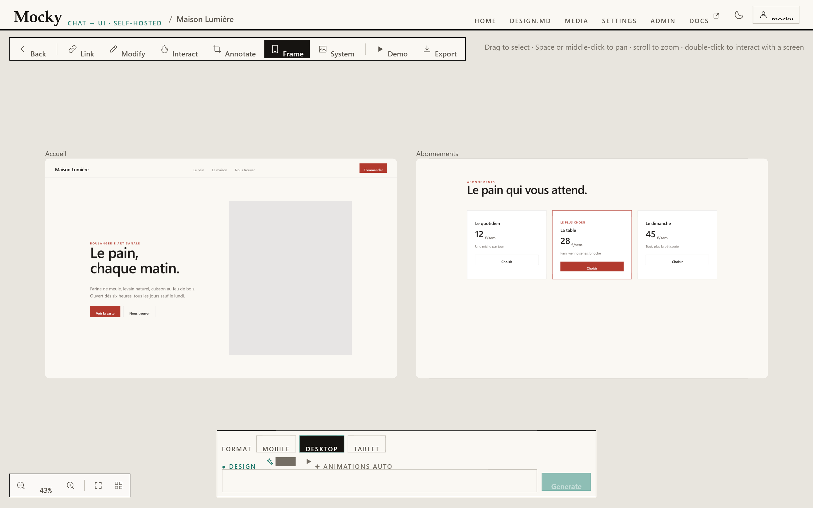

# Mocky

Mocky is a self-hosted screen generator. You describe an interface in plain
language and get a real **React + Tailwind** component, compiled and rendered live
on an infinite canvas.

These pages describe how the project is built and why the non-obvious decisions
were made. They assume you know React and TypeScript.

> The repository `README.md` is the product overview: what Mocky does and how to
> install it quickly. This documentation covers the internals.

*A project open. Screens sit side by side on an infinite canvas; the bar at the top switches modes, and the composer at the bottom describes the next screen.*

---

## The stack

| Layer | What it is |
|---|---|
| Front end | React 18, TypeScript, Vite, Tailwind CSS |
| Back end | Node ≥ 22.12 with Express. JSON files on disk. No database, no native dependencies |
| Preview | An iframe sandboxed to an opaque origin. React, ReactDOM, Babel and Tailwind are vendored locally. JSX is compiled inside the iframe |
| Models | Mocky always speaks the Ollama dialect internally. A proxy translates to OpenAI-compatible APIs |
| External binary | `ffmpeg`, used only for scroll-driven video |

---

## The one thing to know first

**The generation pipeline runs in the browser, not on the server.**

Capability selection, the planner, generation, editing, auto-repair and
persistence all live in `src/lib/`. The back end is deliberately thin: it serves
static files, handles accounts, syncs one JSON file per user, and proxies model
requests.

There is one exception. **Muse** has to spawn processes, drive a headless browser
and write files, so its stages live in `server/muse/`. It is the project's first
real server-side pipeline, and [ADR 001](adr/001-muse.md) explains the reasoning.

---

## Where to start

| If you want to… | Read |
|---|---|
| Install Mocky and configure a model | [Getting started](getting-started.md) |
| Understand the capability registry, the planner and the sandbox | [Architecture overview](architecture/overview.md) |
| Know which rules the code refuses to break, and why | [Invariants](architecture/invariants.md) |
| See what Muse adds to a generation | [Muse overview](muse/overview.md) |
| Follow Discover, Distill and Dossier in detail | [Inspiration engine](muse/inspiration-engine.md) |
| Understand the animation system | [Animations](muse/animations.md) |
| Deploy Mocky | [Deployment](deployment.md) |

---

## What happens when you generate a screen

Seven steps. Steps 1 and 3 are optional.

| # | Step | Where | Notes |
|---|---|---|---|
| 1 | **Muse** builds a design dossier | Server, via `POST /api/muse/dossier` | Optional. Produces an art direction, real copy and a generated image |
| 2 | **`selectCapabilities()`** picks a shortlist | Browser | Deterministic keyword matching. No model call |
| 3 | **`planScreen()`** refines the shortlist | Browser | Optional. Returns `null` on any failure, and the shortlist is used unchanged |
| 4 | **`applyAnimationMode()`** applies your motion preference | Browser | Three states: `auto`, `on`, `off` |
| 5 | **`generateComponent()`** streams the component | Browser, via `POST /__provider/api/chat` | NDJSON stream, sentinel-delimited output |
| 6 | **`stripForbiddenMotion()`** removes raw Motion code | Browser | Babel AST walk, never a regular expression |
| 7 | **`<Preview>`** renders it | Browser | Sandboxed iframe with a strict CSP |

Each step is covered in the [architecture overview](architecture/overview.md).

---

## Three properties worth knowing up front

They explain a lot of the code you will read.

**Muse off means nothing changes.** With the toggle off, the request sent to the
model is byte-for-byte what it was before Muse existed. The dossier enters through
`extraSystem`, the same parameter `DESIGN.md` already used.

**No optional step may block.** The planner resolves to `null` on any failure. A
Muse stage that fails degrades and the generation continues.

**Failure is static, never broken.** An unknown animation preset renders a plain
element. A missing library falls back to CSS. A retired capability is still
injected for the screens that use it.

---

## How this documentation is served

The Markdown files are fetched live from `docs/` on the `main` branch. The page
you are reading is the Markdown file itself, with no build step. Publishing a
correction means pushing a commit.

The viewer is three static Docsify files in `docs-site/`. It has no npm
dependencies and loads nothing from a CDN. See
[Deployment](deployment.md).

**Ces pages existent aussi en français : [documentation française](fr/README.md).**

---

## Other documents in this repository

These predate this documentation and remain authoritative on their subjects.

| Document | Language | Subject |
|---|---|---|
| [ADR 001 — Muse](adr/001-muse.md) | English | The full architecture decision record, including the first written statement of the eight original invariants |
| [Design system](DESIGN-SYSTEM.md) | French | Mocky's own interface tokens, the Papier and Encre themes, the UI primitives. Not to be confused with the `DESIGN.md` a user supplies for generated screens |
| [Audit 2026-07](AUDIT-2026-07.md) | French | The multi-agent audit and its roadmap, most of which has since been applied |

### Why these three are not translated

Each exists in one language only, and that is deliberate rather than an
oversight.

They are **dated records**, not living pages. An ADR states what was decided on
a given day and why; an audit states what was measured at a given moment.
Translating one produces a second copy that can drift from the record — and a
decision record whose two versions disagree is worse than one nobody can read.

The pages linked in the sidebar above are the opposite: they describe the code as
it stands today, they are rewritten whenever the code moves, and they exist in
both languages.

If you need one of the three in the other language, say so — translating them is
a decision to take on purpose, not a gap to fill quietly.
