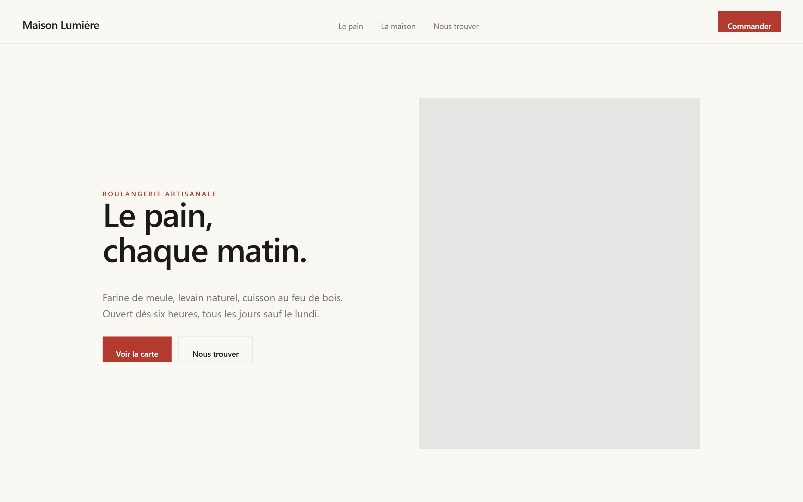

# Architecture overview

## 1. Where things live

The single most structural fact about the project:

> **The generation pipeline runs in the browser.**

| Concern | Runs in | Files |
|---|---|---|
| Capability selection (deterministic) | Browser | `src/lib/capabilities/select.ts` |
| Planner (optional, structured output) | Browser | `src/lib/plan.ts` |
| Generation, editing, repair (streamed) | Browser | `src/lib/generate.ts` |
| Quality pass: check a screen, then correct it | Browser; detection on the server | `src/lib/quality.ts`, `polish.ts`, `server/muse/quality/` |
| SEO / accessibility audit: markup rules, then correct it | Browser; the judged half on the server | `src/lib/audit/`, `server/muse/quality/audit-judge.js` |
| Pipeline orchestration and phases | Browser (React) | `src/components/ProjectView.tsx` |
| `DESIGN.md` bridge (preamble, tokens, spec, export) | Browser | `src/lib/design.ts`, `designTokens.ts`, `designSpec.ts`, `export/` |
| A direction read as a specification sheet, and edited as one | Browser | `src/lib/designSpec.ts`, `src/components/DesignSpecSheet.tsx` |
| Which direction governs a generation | Browser | `src/lib/direction.ts` |
| Sandboxed render | Browser | `src/components/Preview.tsx`, `lib/capabilities/prelude.ts` |
| Persistence | `localStorage`, mirrored to the server when signed in | `src/lib/project.ts`, `sync.ts`, `merge.ts` |
| Accounts, SSO, JSON sync, model proxy | Server | `server/index.js`, `server/provider-proxy.js` |
| Per-account usage: projects, screens, disk | Server | `server/usage.js` |
| Framing the infinite canvas (fit, focus, latest) | Browser | `src/lib/framing.ts` |
| Finding and swapping the images inside a screen (AST, no model) | Browser | `src/lib/screenImages.ts`, `src/components/ScreenImagesDialog.tsx` |
| Muse: MCP, fetching, distillation, dossier | Server | `server/muse/` |
| Images, videos, libraries | Server | `server/images/`, `server/videos/` |
| Video export: schema, the one model call, queue, store | Server | `server/video/` — note the **singular**; `server/videos/` is the clip library |
| Video export: the actual render | A separate, opt-in Docker service | `worker/video/` — Remotion, absent unless `--profile video-export` was built |

The back end is deliberately small: JSON files under `server/data/`, no database,
no native dependencies. The runtime dependencies are `express`, `cookie-parser`,
`@modelcontextprotocol/sdk` and `zod` for Muse, and `impeccable` for the quality
pass.

Writes are atomic — write to a temporary file, then rename. A crash mid-write
never leaves a half-written file.

This "no database, no native dependencies" posture is a de facto invariant, and
the `node:22-slim` image depends on it holding. `impeccable` does not weaken it:
its six runtime dependencies are all pure JavaScript, and the Puppeteer it
declares is **optional**, for a URL-scanning engine Mocky never calls. See
[invariants](architecture/invariants.md) for why that flag lives in the Dockerfile and not in
an `.npmrc`.

---

## 2. The capability registry

A **capability** is something Mocky injects into the preview so a generated
component can use code it did not write itself. There are three kinds, declared
in `src/lib/capabilities/types.ts`:

```ts
export type CapabilityKind = 'cdn-script' | 'cdn-css' | 'snippet-pack'
```

- **`snippet-pack`** — plain JSX, held as a string, prepended to the generated
  code *before* `Babel.transform`. This is the dominant kind.
- **`cdn-css`** — a `<link>` tag.
- **`cdn-script`** — a `<script>` tag that exposes a global.

The `cdn-*` names are historical. **No capability points at a third party.**
`daisyui` loads `/vendor/daisyui.min.css` and `motion-lib` loads
`/vendor/motion.js`, both served by the same server that served the page. That is
[invariant I3](architecture/invariants.md), and it is about the *dependency*, not
about the shape of the tag.

### What ships

| id | Kind | Triggers | Provides |
|---|---|---|---|
| `icons` | snippet-pack | baseline, always selected | `Icon.*` — 42 inline SVG icons, plus 3 aliases (`GitHub`, `LinkedIn`, `YouTube`) |
| `daisyui` | cdn-css | `daisy`, `semantic`, `btn`, `card component`… | A vendored stylesheet of semantic classes |
| `charts` | snippet-pack | `chart`, `graph`, `dashboard`, `analytics`, `sparkline`… | `BarChart`, `LineChart`, `DonutChart`, `Sparkline`, `ProgressRing` |
| `motion` | snippet-pack | none — `retired: true` | `FadeIn`, `Stagger`, `Marquee`, `Counter`, `Reveal`, `ShimmerButton`, `BentoGrid`, `BentoCard`, `BorderBeam`, `TextReveal`, `Meteors`, `AnimatedBeam` |
| `motion-lib` | cdn-script | none — pulled in by `requires` | `window.Motion`, from `/vendor/motion.js` |
| `animate` | snippet-pack | `animation`, `motion`, `hero`, `landing`, `parallax`… | `Animated`, `Ticker`, `CountUp`. Declares `requires: ['motion-lib']` |
| `scrollvideo` | snippet-pack | none — added explicitly | `ScrollSequence` |

### Selection

`selectCapabilities()` is deterministic and calls no model.

It concatenates the user prompt and the design direction in force (`DESIGN.md`,
or the project's own — whichever `resolveDirection` returned), lowercases the
result, and selects a capability if **any** of its keywords or intents appears as
a substring. Then:

1. baseline capabilities are always added;
2. `requires` is resolved transitively, so `animate` pulls in `motion-lib`;
3. `conflictsWith` removes conflicting entries.

This is deliberately coarse. Refinement, when it happens, comes from the planner.
The planner can only **choose from this list**, never extend it.

### Two capabilities with no triggers, for opposite reasons

**`motion` is retired.** `<Animated>` replaced it.

Deleting the entry from the registry would have been the obvious move and would
have been a bug. Capability ids are **persisted on every screen** in
`Screen.caps`, so a screen generated last week still asks for `motion` at render
time. Without the entry its prelude is no longer injected, `FadeIn` and `Marquee`
become undefined, and every one of those screens throws.

So it keeps no triggers, which means the shortlist can never pick it, plus
`retired: true`, which removes it from the capability documentation the model
reads. Old screens keep rendering exactly as before; new screens only ever see
`<Animated>`.

**`scrollvideo` is never guessed.** The component is useless without a `base` URL
and a frame count, and those exist only once Muse has actually paid for a clip.
It is added at generation time when a sequence was produced, and only then. A
screen offered `<ScrollSequence>` with nothing to draw would render a black box
three viewports tall.

### Validation at module load

```js
validatePack(id, components, snippets)
```

This runs for every `snippet-pack` when the registry is imported, and it throws
in both directions: a documented component that no snippet exports, or an export
with no component metadata.

The `exports` list is written by hand, never derived from the source. That is
[invariant I1](architecture/invariants.md) applied to the prelude itself.

### The prelude

`buildPrelude(caps)` concatenates the `cn()` helper, then **all** the sources of
every selected snippet-pack.

Packs are **atomic**: never a subset, never filtered per component. Every source
passes through `sanitizeSource()`.

---

## 3. The planner

`src/lib/plan.ts` is a cheap, non-streamed model call that decides the screen's
structure, its mode, and which capabilities it actually needs, before generation
runs.

```ts
options: { temperature: 0.2, num_ctx: 8192, num_predict: 1024 }
format: PLAN_SCHEMA     // Ollama structured output
stream: false
```

The default timeout is 3 000 ms.

**The planner must never block or break a generation.** A network error, a
timeout, a non-JSON reply, a wrong shape: all of them resolve to `null`, and the
caller silently falls back to the deterministic shortlist. That is why this
module does its own `fetch` instead of reusing `chat()`, which throws.

`validatePlan()` filters the returned capability ids. Only ids that exist in the
registry **and** appear in the shortlist survive, so hallucinated ids disappear.
Baseline capabilities are always re-added, so the planner cannot drop them.

The validated plan becomes a plain-text section appended to the system message.
Structured output is safe here because the call is small and not streamed. It is
**never** used for code generation, which would break both the live preview and
the sentinel protocol.

The planner is **skipped when Muse ran**, because the dossier already supplies
the structure.

### The mode

`PLAN_SCHEMA` carries a fifth property, `mode`, constrained to four values:

```ts
export type ScreenMode = 'persuade' | 'operate' | 'read' | 'experience'
```

It records what success looks like for the visitor of *this* screen, and the
distinction is about the surface, not the product: one project routinely holds
all four — a landing page persuades, its dashboard operates, its docs are read,
its gallery is experienced. Naming it lets the generation prompt ask for the
right thing, because the right thing is not the same in each. A landing page that
is merely scannable has failed, and so has a settings page that is expressive.

`mode` is the one property deliberately **left out of `required`**. The prompt
asks for it and the schema constrains it, but a model that cannot satisfy the
enum should still return a usable plan rather than fail structured output and
lose the capability choice along with it. `validatePlan()` holds the same line
from the other side: an invented fifth mode becomes `undefined` instead of
sinking the whole plan over a label.

Which leaves the question of where the mode comes from on the runs that have no
plan — and that is nearly all of them, since the planner is skipped on every Muse
run and switched off entirely by a setting. Hence the order in the generate
callback of `ProjectView.tsx`, between the deterministic shortlist and the
generation call:

1. `inferMode(text)` — a keyword guess, deliberately crude and deliberately
   biased towards `operate`: app UI is the common case, and wrongly guessing
   `persuade` costs an expressive settings page, which is worse than the reverse.
2. The planner, on the rare runs where it does execute, replaces that guess with
   its own `mode` — but only when it actually returned one.
3. `if (!planSection) planSection = modeToPromptSection(mode)`

The third line is the load-bearing one. The mode is appended as a prompt section
of its own rather than folded into the plan, which is what makes it reach
generation on **every** path — including the paths where no plan was ever
produced.

---

## 4. Generation



*What comes out: a single self-contained React + Tailwind component, compiled inside the sandbox and rendered live.*

### The sentinel protocol

The model is asked to wrap its output:

```
<<<MOCKY>>>
…the complete component…
<<<END>>>
```

Not Markdown fences. The reason is streaming: partial code can be extracted as
soon as it arrives, without waiting for a closing fence.

`extractCode()` tries three things in order: sentinels, a legacy fenced code
block for backward compatibility, then the raw content.

#### Why the closing sentinel is matched loosely

The closing sentinel is accepted **as it arrives**, not as it was requested. One
real screen ended like this:

```
const __mockyDefault = App
<<<END>>ablytyped
```

One `>` short, with a fragment of prose welded on. `indexOf('<<<END>>>')` found
nothing, so the tail was kept **as code**, and every later compile of that screen
died on "Unterminated JSX contents".

`<<<` is not valid JavaScript anywhere outside a string. The moment it appears at
the start of a would-be sentinel, the code is over. `stripTrailingSentinel()`
cuts there, both at extraction and at render, so screens already stored with a
corrupted tail heal on their next load instead of failing forever.

### Parameters

```ts
options: { temperature: 0.4, num_ctx: 32768, num_predict: 16384 }
```

A full screen easily exceeds 8 000 tokens. When the cap is hit the code is cut
mid-string and the preview shows an incomprehensible syntax error, so the budget
is generous. `num_predict` must stay strictly positive — see
[invariant I8](architecture/invariants.md).

Truncation is detected through `done_reason` or `finish_reason` being `length`,
including via `choices[0]`, and reported to the user in plain words.

### Streaming

The response body is read as NDJSON: one JSON object per line. A partial line is
kept in a buffer and completed by the next chunk.

Each content fragment calls `onChunk(extractCode(full, { streaming: true }))`, so
the preview rebuilds live.

In streaming mode `extractCode` does **not** cut on an approximate closing
sentinel. A half-written sentinel is just the next few characters arriving, and
cutting on it would truncate the preview on every chunk. Once the response is
complete, a malformed sentinel is all there will ever be, so it does cut.

### The five call sites

| Function | Used for | Additional rules |
|---|---|---|
| `generateComponent()` | A new screen | `extraSystem` carries the project's design direction (`resolveDirection` — the established one, this run's Muse dossier, or `DESIGN.md`), the earliest screen as an identity reference, plus capabilities and the plan |
| `editComponent()` | Editing selected screens | `EDIT_RULES`: preserve everything the user did not ask to change, byte for byte. The complete component is returned, not a diff |
| `fixComponent()` | Auto-repair after a render error | Not streamed. Receives the **same** capability prompt — without the list of existing globals the model cannot tell which component is undefined, and swaps one React #130 error for another |
| `polishComponent()` | Correcting named quality findings | Not streamed either: the caller re-checks the result, and a partial screen cannot be checked. Receives the capability prompt as well, and `POLISH_PROMPT` in place of `FIX_PROMPT` |
| `auditFixComponent()` | Correcting named SEO / accessibility findings | Not streamed either. Receives `AUDIT_FIX_PROMPT`, whose central instruction — *the screen must look exactly the same afterwards* — is the inverse of `POLISH_PROMPT`'s |

`polishComponent` and `auditFixComponent` are deliberately **siblings** of
`fixComponent`, never variants of it. All three share the transport, the
extraction tail and the caller's write-back conventions, and nothing else,
because each one's central instruction is fatal to the other two. `FIX_PROMPT`
says "fix ONLY the error, do not restyle": right for a crash, and exactly wrong
for a slop finding, which *is* a styling problem — a model told not to restyle
hands the screen back unchanged and burns an iteration. `POLISH_PROMPT` invites
visual change, which is right there and wrong for an accessibility pass, where a
semantics correction returned as a redesign has failed even with every finding
gone. See [SEO and accessibility](seo-accessibility.md) for the third one's
own loop. In each case the findings are filtered by the caller to those the
policy marks enforceable, so a pass is never spent on a rule Mocky has decided
not to insist on.

All five end on the same expression — `guardMotion(extractCode(content))` — which
is where the complete generated source first exists. That is why the count in
this heading is worth keeping accurate, and why it is worth grepping rather than
trusting: it read "three" until `polishComponent` arrived and "four" until
`auditFixComponent` did. A post-generation check hooked onto `generateComponent`
alone sees neither an edit, nor a repair, nor a polish, nor an accessibility
correction.

### Editing without a model call

`tryDirectTextReplace()` handles the common case. If the clicked element's
visible text appears **exactly once** verbatim in the source, it is replaced in
place: instant and free.

Zero or several occurrences return `null`, and the caller falls back to a
targeted model edit. This is not name discovery, so it does not violate invariant
I1: it swaps a literal the user is directly looking at.

When a model call is needed, anchoring is **text-first**. The rendered DOM path
(`nth-of-type`) cannot be reliably mapped back to JSX, whereas the element's
exact class string appears verbatim in the JSX and is the strongest anchor. The
selector is passed only as a last-resort hint.

### The Motion guard

`guardMotion()` runs every output through `stripForbiddenMotion()`, a real Babel
AST walk rather than a regular expression. See
[Animations](muse/animations.md).

---

## 5. Framing the canvas

Before the sandbox, what surrounds it. `src/lib/framing.ts` decides what the
infinite canvas shows, and it lives apart from `Canvas.tsx` because it is
arithmetic — and because the arithmetic was wrong.

**The bug it was extracted to fix.** "Fit all" computed an `{x, y, scale}` once
and left it there, so it framed the project for whatever the container measured
at the instant the button was pressed. Resize the window, open a side panel,
rotate a tablet, and the numbers still described a container that no longer
existed. The button looked like it worked and then quietly stopped agreeing with
the screen, with nothing to click to find out why.

### Keeping the intent, never the result

The fix is a type:

```ts
export type Framing = { kind: 'all' } | { kind: 'screen'; id: string } | null
```

What the view is framed **on**, not the numbers that framing produced. The
numbers can then be recomputed from scratch every time the container changes
size, which is the only thing that makes the answer stay true.

`null` is the third value and the most important one. Any manual pan or zoom
clears the framing, because re-imposing ours on the next resize would be the
very same bug, aimed this time at the person who had just corrected it by hand.

### The observer watches the container, not the contents

`Canvas.tsx` observes the **container** element with a `ResizeObserver`, and
`screens` is deliberately not a trigger. Dragging a frame changes the bounding
box, and re-fitting mid-drag would pull the board out from under the pointer.
Only the question's container is allowed to invalidate the answer — which
catches more than the window: a side panel opening, browser chrome appearing on
a tablet, the phone/desktop switch.

The observer's first callback is ignored on purpose. `ResizeObserver` fires once
on `observe()`, before anything has actually resized, and re-framing there would
override the caller's own first framing.

### Two ceilings, and why they differ

| Constant | Value | Why |
|---|---|---|
| `FIT_MAX_SCALE` | 1 | A board blown up past life size is no longer showing you an arrangement |
| `FOCUS_MAX_SCALE` | 0.9 | One framed screen keeps a visible edge instead of bleeding off the container |
| `MAX_SCALE` | 1.5 | Neither of the above: this is the ceiling the wheel and the +/− buttons obey |

### `contentBox()` — the column that hangs off the side

The image/design column beside a frame is drawn **outside** the frame's box, so
bounding the project on `x + w` framed it with every card sliced down the middle.
Only screens that actually draw one (`imageHash`) are widened; adding the
column's width unconditionally would loosen the fit of a project that has no
cards at all, which is most of them.

`CARD_W = 320` and `CARD_GUTTER = 40` are in **world** units, not screen pixels.
Anything sized against the zoom occupies a footprint that changes with it, and a
neighbour that moves when you zoom out is the one thing an infinite canvas must
not do.

### `latestScreenOf()` sorts on `createdAt`

Not the selection, which moves every time the user clicks anywhere. Not the tail
of the array either: `addScreen` only appends, but nothing promises the order
survives an import or a merge from another device. `createdAt` is the one of the
three that still answers "the last one generated" in all of those cases.

Two controls in the zoom bar expose all of this — `Fit all` and `Zoom to the
latest screen`. Their labels, their icons and what they cost are in
[The interface](interface.md#the-zoom-bar).

---

## 6. The sandbox


*The ten verbs of a project, in bar order: Link, Modify, Interact, Annotate, Frame, System, Audit, Demo, Export, Video. The first four act through the sandboxed preview; the last six act around it. The screenshot predates two of them — Audit, which sits between System and Demo, and Video, which closes the row — so eight verbs are visible here, not ten.*

`Link`, `System` and `Audit` are **mutually exclusive**, because all three open a
panel into the one slot at `right-4 top-11`. It used to be enforced in the click
handlers, and that is exactly how it broke: each button turned off the ones its
author had in mind, `Audit` cleared `System` and neither cleared `Link` mode, so
the audit report and the Links list were painted on top of each other with no
z-index to settle which won and the controls underneath stopped being clickable.
`src/lib/rightSlot.ts` now holds a **single value** naming the occupant — two
open panels is a state the type cannot express — and a fourth panel arriving
cannot forget a clear nobody wrote. It is the kind of detail a legend should
carry, because nothing on screen explains why turning one on turns another off.
Every control in that toolbar is documented, with its exact label and what it
costs, in [The interface](interface.md#the-project-toolbar).

`src/components/Preview.tsx` builds a self-contained HTML document and injects it
as `srcDoc`.

### The iframe

```html
<iframe sandbox="allow-scripts" srcDoc={srcDoc} />
```

`allow-scripts` and nothing else. Without `allow-same-origin` the origin is
opaque: no `localStorage`, no cookies, no access to the parent DOM. Blob URLs are
same-origin relative to that opaque origin, so the compiled module runs without
CORS. This is [invariant I2](architecture/invariants.md).

A test reads the source file and requires **exact equality** of the attribute,
not a substring match. `"allow-scripts allow-same-origin"` contains
`"allow-scripts"`, so an `includes` check would have passed while the frame ran
model-generated code with Mocky's own origin.

### The Content-Security-Policy

`allow-scripts` alone restricts nothing outbound. A generated component could
call `fetch()`, `sendBeacon()` or `new Image().src = …` against any host, from
the user's IP, on every render.

```
default-src 'none'
script-src  <parent origin> 'unsafe-inline' 'unsafe-eval' blob:
style-src   <parent origin> 'unsafe-inline'
img-src     * data: blob:
font-src    * data:
connect-src 'none'
form-action 'none'
frame-src   'none'
object-src  'none'
base-uri    'none'
```

`'self'` would be a trap. The document has no origin of its own, so `'self'`
serialises to `"null"` and would block React, Babel and Tailwind. The parent's
origin is named explicitly instead.

`img-src` stays permissive on purpose. A remote image is a weak tracking vector,
but it is also how a mockup shows a photo, and models legitimately emit picture
URLs.

`'unsafe-inline'` and `'unsafe-eval'` are unavoidable: the whole point of the
document is to run code compiled at runtime.

### What the document loads

React, ReactDOM and Tailwind first, then the capability tags, then Babel — all
from `/vendor/`.

Every file is hash-pinned in `public/vendor/VENDOR.md` and verified by
`npm run check:vendor`, which runs in CI. Previews therefore work **offline**,
and a CDN compromise cannot reach them.

No tag carries `crossorigin`. Since the origin is null, that attribute would turn
every script into a CORS request with `Origin: null`, which the server does not
handle, so the script would fail to load.

### The compilation path

1. The source is base64-encoded into a `<script type="text/plain">`. This removes
   every character that could break the HTML or the template: backticks, `${`,
   quotes, newlines, `</script>`.
2. The prelude is encoded the same way, when there is one.
3. `Babel.transform(prelude + '\n' + source, { presets: [['react', { runtime: 'classic' }]] })`
   runs **inside the iframe**.
4. The result executes through a `blob:` URL, which gives real error positions.
5. The component mounts inside a React error boundary.

The boundary is necessary because `createRoot` renders **asynchronously**. A
render error is thrown after the synchronous `try/catch` has already returned, so
it would escape to `window.onerror` as an opaque "Script error." — the module
comes from a `blob:null` origin.

The boundary catches it with the real message and the component stack, and posts
it to the parent. That feeds both the error box and `fixComponent`. It only ever
fires on real errors, which is
[invariant I5](architecture/invariants.md).

React error #130 is rewritten before being reported, because its minified message
teaches nothing:

> Element type is invalid (React #130): a component or icon you rendered is
> undefined — likely a missing or misspelled name.

### The interaction bridge

A small script inside the frame talks to the parent over `postMessage`.

| Message | Direction | Purpose |
|---|---|---|
| `pick` mode | Parent → frame | Highlight the hovered element. On click, report a CSS selector, the visible text, the tag and the class string |
| `demo` mode | Parent → frame | Given a list of `{selector, target}` pairs, a click asks the parent to navigate |
| `ok` | Frame → parent | The component mounted successfully |
| `error` | Frame → parent | A compile or runtime error, with its real message |
| `size` | Frame → parent | The rendered content height |

In pick mode the selection is exact for *Modify*, and walks up to the nearest
interactive ancestor for *Link*.

Identity comes from **the sending window**, never from a field inside the
message. `frameId` is written in clear into every `srcDoc`, so one preview could
read another's id out of the DOM and forge messages on its behalf. And `e.origin`
is the useless string `"null"` for every sandboxed frame.

```js
if (e.source !== iframeRef.current?.contentWindow) return   // in the parent
if (e.source !== window.parent) return                      // in the frame
```

Symmetrically, a frame may only report a pick while pick mode is actually on, and
may only request navigation while it has demo links. Without those checks a
rendered component could drive the parent's UI at will.

### Keeping the mockup inside its own document

A sandboxed frame is always allowed to navigate **itself**. An `<a href="/">`, a
submitted form, a `location.assign()` — any of them make the frame drop the
`srcDoc` and load Mocky's own `index.html`. Because its origin is opaque, every
module script of the app then fails CORS: a white screen, a console full of
errors, and the screen the user just generated is gone.

Four guards, in depth:

1. **`window.open` is neutralised** before any generated code runs.
   `window.location` is deliberately untouched: it is a non-configurable
   accessor, so redefining it throws and would take the whole bridge down.
2. **A capturing click handler cancels every `<a href>` and `<area href>`**,
   fragments included. A `srcdoc` document inherits the *parent's* URL as its
   base, so `#pricing` resolves to `http://localhost:8787/#pricing` — a different
   document. The scroll a fragment was meant to perform is done by hand with
   `scrollIntoView`, so in-page anchors still behave like anchors.
3. **Form submissions are cancelled.** A `<form>` with no `action` posts to the
   document URL, which is Mocky's own page.
4. **The parent counts the frame's `load` events.** The first load is the
   `srcDoc`; any later one means the frame went elsewhere. The parent then
   re-assigns `srcdoc`, an attribute it owns whatever the frame's origin, and
   shows a "links are inert" notice for three seconds.

### Timing

The `srcDoc` is rebuilt with a **500 ms debounce**, so a token stream does not
rebuild the iframe on every character.

A **20 second timeout** prevents waiting forever if no message arrives.

During generation, errors are ignored because the code is incomplete by
construction. An error whose source code has changed since the `srcDoc` was built
is discarded as stale.

### Capture: the exception that no longer is

`src/lib/capture.ts` used to mount a **same-origin** iframe, and this document
used to explain at length why that was unavoidable. It no longer is.

The reason was html2canvas: it has to read the document it photographs, and it
clones that document into an iframe of its own, so a sandbox without
`allow-same-origin` gave every descendant a **fresh** opaque origin and the frame
could not read its own clone. It failed with "Blocked a frame with origin null
from accessing a cross-origin frame", on the default path and with
`foreignObjectRendering` alike.

Mocky now snapshots with **snapdom**, which serializes the subtree into an SVG
`<foreignObject>` with every node's computed style inlined, then rasterizes that
through a `data:` URL. Nothing in that path crosses an origin boundary, so the
capture frame carries `allow-scripts` and nothing else — exactly like a preview.
For the second or so of a capture, the model's code no longer runs with Mocky's
origin, which means it can no longer read the provider API key out of
`localStorage` or reach into `window.parent`.

Measured in an opaque origin before the change was made: the capture succeeds,
`toDataURL()` does not throw (the canvas is not tainted), Tailwind's injected
utilities are honoured, and `rgb(var(--token) / 0.5)` composites to the exact
pixel. 113 ms by default against 111 ms for html2canvas with the origin open.

Two consequences worth knowing:

- **`connect-src` had to open to this origin.** snapdom inlines a picture by
  fetching its bytes; under `connect-src 'none'` every fetch was blocked and each
  image became a grey placeholder. `/api/images/:hash` therefore also answers with
  `Access-Control-Allow-Origin: *` — it is already unauthenticated by design, so
  a wildcard exposes nothing. Every other outbound directive stays shut, so there
  is still nowhere to send anything.
- **A hidden tab defers the capture.** snapdom rasterizes by awaiting
  `img.decode()`, which never settles in a document the browser is not
  compositing: backgrounded, the same capture took 39 s where html2canvas took
  1 s. The shell now waits for `visibilitychange` rather than burning its
  watchdog.

---

## 7. One dialect for every model

Mocky always speaks the Ollama dialect internally: `POST /api/chat`, with
`options`, `num_ctx`, `num_predict`, `format`, and NDJSON streaming.

`server/text/dialect.js` translates to and from OpenAI-compatible APIs: request
shape, `response_format`, vision attachments as `image_url`, and SSE to NDJSON.
Generation, the planner and Muse are therefore vendor-agnostic, with no second
code path.

The proxy lives in two places that share the same module: a Vite middleware in
development, and `app.use('/__provider', …)` in Express for production.

Three protections apply.

**An allowlist of subpaths.** `/api/chat` and `/api/tags`, nothing else.

**An SSRF guard.** `assertSafeTargetResolved()` accepts http and https only,
rejects `localhost`, private ranges, link-local addresses and
`169.254.169.254` — then **resolves the hostname in DNS and re-checks every
returned address**. Without that second step, a hostname the caller controls
(`evil.test` → A 127.0.0.1) walked past the string tests untouched. IPv4-mapped
IPv6 forms are covered explicitly, in both spellings: `::ffff:127.0.0.1` and its
hexadecimal twin `::ffff:7f00:1`.

**A bounded body.** `readRawBody()` stops at 25 MB. Unbounded, it accumulated
whatever the client sent and then called `Buffer.concat` inside the `end`
listener. A body past `buffer.constants.MAX_LENGTH` threw outside any promise
chain and, with no `uncaughtException` handler, took the whole server down.

An **administrator-configured** target deliberately bypasses the SSRF guard.
Pointing at a local model — Ollama, LM Studio or vLLM on `127.0.0.1` — is a
supported setup, and only an administrator can set it. The guard stays fully in
force for any URL that came from a browser.

When an instance provider is configured, `/__provider` **requires a session**.
The request spends the host's credits, so it must belong to someone. With no
instance provider, the caller supplies its own key and the "your key never leaves
your browser" mode is preserved.

---

## 8. Persistence

### In the browser

| `localStorage` key | Contents |
|---|---|
| `mocky.projects.v1` | Projects, with screens, positions and links — and each project's own design direction |
| `mocky.design.v1` | The global `DESIGN.md` and its toggle — the fallback for a project that has no direction of its own |
| `mocky.settings.v1` | Provider, base URL, **API key**, planner on or off |
| `mocky.muse.v1` | Muse configuration: inspiration URLs, image mode, video, pinned media |
| `mocky.animations.v1` | `auto`, `on` or `off` |

### On the server

One file per user, `server/data/data-<uuid>.json`, holding serialised `projects`
and `design` plus an `updatedAt` timestamp. Two routes: `GET /api/data` and
`PUT /api/data`.

Syncing is **deferred and observable**. `scheduleSync()` marks state dirty, and a
`idle | syncing | failed` state is broadcast to subscribers so a failure is
visible in the UI. Previously a sync that gave up after thirty seconds of retries
was visible to nobody, not even the console.

Reconciliation compares `updatedAt` on both sides instead of assuming the server
is fresher, which used to overwrite local work. The merge in `src/lib/merge.ts`
uses tombstones with a TTL, so a deletion on one device does not come back from
another.

### The server store

| Path under `server/data/` | Contents |
|---|---|
| `users.json` | Accounts: scrypt salt and hash, role, `dashySub` |
| `sessions.json` | Token → `{ u: userId, t: timestamp }` |
| `config.json` | `{ allowRegistration }` |
| `sso-jti.json` | Consumed SSO token ids, pruned after 10 minutes |
| `data-<uuid>.json` | One user's projects and design |
| `avatars/<userId>` | One file per account that uploaded a picture. Counted as `bytes.avatar` in the usage report |
| `text-config.json` | Administrator-configured text providers, including secrets |
| `images-config.json` | Image providers and scroll-sequence video settings, including secrets |
| `video-config.json` | Video **export** settings: the master switch, the access mode and its allowlist, the worker URL, and the Remotion licence key in clear — hence mode `0600`, and hence `publicView()` turning it into a `hasLicenseKey` boolean before anything leaves the server |
| `muse-cache.json` | Distillations, 7-day TTL, text only |
| `image-library.json` | Image library metadata — including `owners`, the account ids that put each file there, **capped at 20** |
| `image-library/<hash>` | The image bytes |
| `video-library/` | Scroll sequences: clip, frames and poster. Its metadata carries `owners` under the same cap |
| `video-exports.json` | Exported films: bytes, container, scene count, duration — and `owners` under the same cap. Never the timeline, which carries somebody's overlay text |
| `video-exports/<hash>.mp4\|.webm` | The finished film, whole. A different directory from `video-library/` on purpose: that one holds *scroll sequences*, cut into stills by ffmpeg, and every consumer of its `list()` expects frames a film does not have |
| `video-jobs.json` | The render queue's journal: the newest 50 finished jobs, plus whatever is live. A job found mid-flight at boot is marked failed, never resumed |

Files holding secrets are written with mode `0600`. The default `0644` left them
readable by every other account on the machine.

The cap on `owners` is the same one `tags` and `projects` carry beside it, for
the same reason: these indexes are re-serialised **whole** on every write, so
nothing inside them may grow without a ceiling.

---

## 9. HTTP surface

| Method and route | Auth | Purpose |
|---|---|---|
| `GET /api/health` | — | `dataWritable` and `frontendBuilt`; `503` with a `detail` naming what is wrong |
| `GET /api/config` | — | Registration open?, setup mode, SSO, instance model (no secrets) |
| `POST /api/register`, `/api/login` | rate-limited | The first account becomes administrator |
| `POST /api/logout`, `GET /api/me` | cookie | `/api/me` answers `200 { user: null }`, not `401` |
| `POST /api/account/password` | session, rate-limited | Revokes every session and issues a fresh one |
| `GET /sso/dashy/callback` | rate-limited | Verifies the HS256 token, finds or creates the account |
| `GET`/`PUT` `/api/admin/config`, `/users`, `…/password`, `DELETE /users/:id` | admin | Instance and user management |
| `GET /api/admin/usage` | admin | Projects and disk per account. Its own route because it parses every projects blob and walks a directory per scroll sequence; answers `200` with an `error` field rather than a status, so a failed report never breaks the Admin screen |
| `GET`/`PUT` `/api/admin/text/config`, `POST /api/admin/text/test` | admin | The test sends a real request |
| `GET`/`PUT` `/api/admin/images/config`, `POST /api/admin/images/test` | admin | The test generates a real image, not stored |
| `POST /api/text/vision` | session | Probes the model's vision support. **Goes through the SSRF guard** |
| `GET`/`PUT` `/api/data` | session | The user's projects and design |
| `GET /api/mcp/status` | session | State of every declared MCP server |
| `POST /api/muse/dossier` | session | Discover → Distill → Dossier |
| `POST /api/muse/audit` | session | The judged half of the SEO/accessibility report. `400` only when `code` is missing; **`200` with an empty list and a notice when there is no model** |
| `POST /api/muse/quality` | session | `{ code, hasDirection, critique }` in, one report out. `400` only when `code` is missing; **`200` even with no model configured** — see below |
| `POST /api/images/generate`, `/upload` | session, 30/min | Generation is the expensive verb |
| `GET /api/images/library`, `/library.zip`, `POST /:hash/favorite`, `DELETE /:hash` | session | Library management |
| `POST /api/images/:hash/confirm` | session, owner | Clears the `pending` mark on an image the multi-step variant flow produced. One-way and idempotent: there is no un-confirm, because "nobody has looked at this yet" is a fact about the past |
| `GET /api/images/:hash` | **public** | See below |
| `POST /api/videos/generate` (6/min), `/upload` (20/min) | session | Different ceilings: generating costs money, uploading costs disk |
| `GET /api/videos/library`, `/:hash/meta`, `DELETE /:hash` | session | Sequence management |
| `GET /api/videos/:hash/poster.jpg`, `/:hash/f/:n.jpg` | **public** | See below |
| `GET /api/video/status` | session | Video **export** — note the singular. Access, worker health, and the schema bounds the panel quotes |
| `POST /api/video/compose` (12/min) | session | The one model call in the feature. Proposes a montage over images **the user has already selected**: it orders and tunes, it never picks. An `imageId` from outside the selection is refused, never substituted, and a document the schema rejects is refused whole rather than repaired. Answers **`200` with `timeline: null` and notices** when nothing usable came back — a proposal that did not happen is not a request that failed (Q1). `409` when the selection still holds an image nobody confirmed: the same guard as `/render`, checked here too so a discard cannot become scene four |
| `POST /api/video/variants` (6/min) | session | Two to six takes on one library image. Metered like `/api/videos/generate` rather than like `/compose`, because each variant is a provider call. Answers `derived`: with an `edit` image profile the pictures come out of the user's own, without one they are siblings born of the same text — and an interface that showed the two identically would be lying |
| `POST /api/video/render` (6/min) | session | Validates the timeline, then queues. `400` with the issue list, `404` naming absent images, `409` when the selection still holds an image nobody confirmed, `507` when the volume is already full |
| `GET /api/video/jobs/:id` | session | `403`, not `404`, on someone else's job: a job carries the timeline, and a timeline carries their overlay text |
| `GET /api/video/:hash` | session | The finished film. **Never public** — ownership is checked before existence, so an unknown hash and a stranger's answer alike |
| `GET`/`PUT` `/api/admin/video/config`, `GET /api/admin/video/health` | admin | The licence key leaves as `hasLicenseKey`, a boolean |
| `ALL /__provider/api/chat`, `/api/tags` | session **if** an instance model is configured | Proxy and dialect translation |

### Why image and frame bytes are public

This is deliberate and load-bearing.

Preview iframes are sandboxed **without** `allow-same-origin`, so their origin is
opaque and their subresource requests carry **no SameSite cookie**. An
authenticated `/:hash` route would blank out every image in every mockup.

An exported ZIP also references these URLs from a machine with no session.

**The URL is the capability**: a 64-character hexadecimal SHA-256 of the content,
which cannot be guessed and is only ever handed out by an authenticated listing.
The pattern is exact — `PUBLIC_IMAGE_PATH = /^\/[a-f0-9]{64}$/` — so listing,
generating and deleting all stay behind a session.

The guard is attached to the **subpaths** the routers serve, not to the `/api`
mount. Mounted on `/api`, it ran for every later `/api/*` route too, which
silently put the public bytes behind authentication.

### Why `owners` never reaches a browser

The other half of the same question. `server/images/routes.js` and
`server/videos/routes.js` both strip `owners` from every listing before it
leaves the server, and that is a privacy decision rather than a tidiness one.

The media libraries are **instance-wide**: every signed-in user lists every
image. Left in the payload, an ordinary account learns its own id from the
`meta` of its first upload, subtracts its own images from the list, and now
holds the global library partitioned by author — who produced how much, and
which prompts belong together. That is exactly why `publicUser()` in
`server/index.js` omits `id`, and why only `GET /api/admin/users` ever
publishes one.

It costs the feature nothing: nothing under `src/` reads `owners`. The usage
report consumes it server-side, through `collectUsage`, which reads the library
object directly.

### Why the quality check answers 200 with no model

The route is session-gated like the rest of Muse — `app.use('/api/muse',
requireUser)` — and it refuses a request in exactly one case: no `code` to look
at, which is a `400`. An absent model is not that case.

A report has two halves. The deterministic rules need nothing but the source; the
judged pass needs a model. Credentials follow the dossier route exactly — an
administrator-configured provider wins, otherwise the browser's own headers, the
same ones `/__provider` reads. With no credentials the first half still runs and
the second reports itself unavailable, so there is a real answer to return: the
findings that were found, an audit that says which dimensions were actually
looked at, and a notice naming what did not run. A `4xx` would instead say "this
screen could not be checked", which is untrue, and the browser would raise it as
a failure over a screen that had generated perfectly well. Degrade, never fail —
[invariant Q1](architecture/invariants.md).

---

## 10. Export

`src/lib/export/project.ts` assembles a runnable **Vite + React + Tailwind**
project from the screens, with three targets.

| Target | Contents |
|---|---|
| `plain` | Tailwind plus Mocky's UI packs, vendored into the project |
| `shadcn` | The above, plus `components.json`, the standard `cn()` and the shadcn Tailwind theme, so `npx shadcn add …` inherits the brand through `globals.css` |
| `daisyui` | Tailwind plus the daisyUI plugin |

The JSX-to-ESM rewrite in `export/rewrite.ts` goes through Babel, never a regular
expression. It first transforms JSX into `React.createElement` so every component
reference becomes an ordinary identifier, then queries the scope.

`export/theme.ts` turns `DESIGN.md` into `globals.css`. Regular expressions are
allowed there because they scan **Markdown prose**, not code — the explicit
exemption in invariant I1.

The ZIP is written by `src/lib/zip.ts`, with no dependency: store method plus
CRC32. The same writer serves the image library's "Download all" and
`npm run backup`.

**This is not Motion**, which shares only the word. That one turns
images from the media library into an `.mp4` on a separate, opt-in Docker service
and never touches a screen — see [Motion](video-export.md).

---

## 11. Tests

`npm test` runs Vitest across the repository. Five suites are worth knowing
about, because they read **what actually ships** rather than an abstraction of
it.

**`tests/preview-sandbox.test.js`** locks the preview's security posture by
reading `Preview.tsx` and `capture.ts`: the exact `sandbox` value, the absence of
external tags, the CSP directives, the navigation guard, the behaviour of the
"no animation" mode, and the `postMessage` validation.

It exists because the only test enforcing invariant I3 looked at the
**registry**, and therefore never saw the `<script src="https://…">` tags written
directly into `buildSrcDoc`. Both had drifted to CDNs unnoticed.

**`tests/tokens-contrast.test.js`** reads `src/styles/tokens.css` and checks that
every text-on-background pair clears WCAG AA. Measured on the shipped values
before the fix: `text-slate-500` gave 2.09:1 on the beige theme, and the active
toolbar button measured 1.21:1 — its label was invisible.

**`tests/i18n-parity.test.js`** requires every key to exist in both French and
English, and no component to contain a hard-coded sentence. The interface used to
be bilingual **inside single components**: five components in French, twelve in
English, two mixed.

**`tests/docs-parity.test.js`** does the same for the documentation. Four pairs —
the two READMEs, the design system, ADR 001 and the July audit — must carry the
same number of headings, at the same levels, in the same order; each file points
at its twin with a language switch, and under every heading sits a one-line block
saying why the section is arranged the way it is, in that file's own language and
never the other's. Kept by hand, that convention decays where nobody looks: a
heading translated on one side and forgotten on the other, an ASCII hyphen where
the template has an em dash, an English block pasted into the French file. The
documents were going exactly where the interface had already been — a French
design system, an English ADR, a French audit, an English README, and no way to
tell which reader each was written for.

The same suite also holds the **other** mirror family, the one that carries most
of this documentation: `docs/` in English, `docs/fr/` in French, path for path.
Nothing checked it until it was needed — the four twins above sit side by side
with a language suffix, and the tests written for them never reached a tree
mirrored by directory. So every page here has to exist on both sides, with the
same headings at the same levels, in both directions. Existence is the cheap half
and the half that catches the real mistake: adding a page under `docs/` and
stopping there fails no build and leaves the French sidebar pointing at nothing.

**`tests/video-worker-separation.test.js`** keeps Remotion out of Mocky. It reads
`package.json` for a Remotion package in **any** dependency field — including
`peerDependencies`, the one that looks harmless because it installs nothing and
still puts Remotion in the tree of whoever resolves it — plus the source tree for
an import, `.dockerignore` for the `worker/` exclusion, and `docker-compose.yml`
for the `video-export` profile and the internal network.

It exists because the separation was argued for in four documents and guarded by
none of them, and prose does not fail a build. One `npm install remotion` at the
repository root to "just try the composition locally" and the default image ships
Remotion to every operator who never asked for it — which is a licensing
regression, not a size one, and no later test can un-ship it. The same suite
refuses a queue server or a database driver, because a job runner is exactly the
feature somebody reaches for Redis to build. See
[Motion](video-export.md).

Alongside those: `registry.test.ts` for registry invariants at load time,
`ssrf-guard.test.js`, `routes-auth.test.js`,
`server/muse/quality/quality.test.js` for detection, the policy, the judged
catalogue and the audit, `src/lib/quality.test.ts` for the merge of the local
placeholder lint with the server's findings and for the signature progress is
measured on, `src/lib/polish.test.ts` for the correction loop — its four stopping
conditions are exercised with the check and the correction injected, so neither a
provider nor a server is needed — `src/lib/designSpec.test.ts` for the two shapes
a direction can take and for the edits made through the sheet, and the Muse,
images and video suites.

### CI

`.github/workflows/ci.yml` runs `build`, `test`, `check:vendor` and
`npm audit --omit=dev` on Node 22 **and** 24. 22 matches the Dockerfile and the
`.nvmrc`; 24 is the next LTS, kept in the matrix because the two have diverged
before. Node 20 was dropped when the quality pass landed: `impeccable` requires
22.12 or later, and Node 20 left support in April 2026.

It then builds the Docker image, **starts it**, and waits for it to answer.
Building only proved that the Dockerfile parses; starting catches a missing
`COPY`, a broken `CMD`, or an unwritable data directory.

One step checks explicitly that `mocky.mcp.json` made it into the image. It had
gone missing once, and Muse started zero MCP servers while the image still paid
its 300 MB of Chromium.
