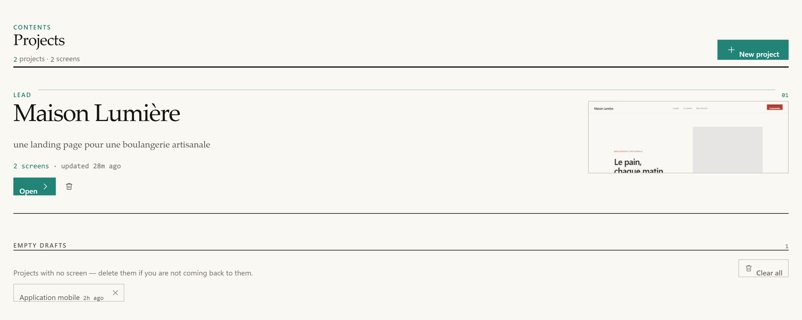
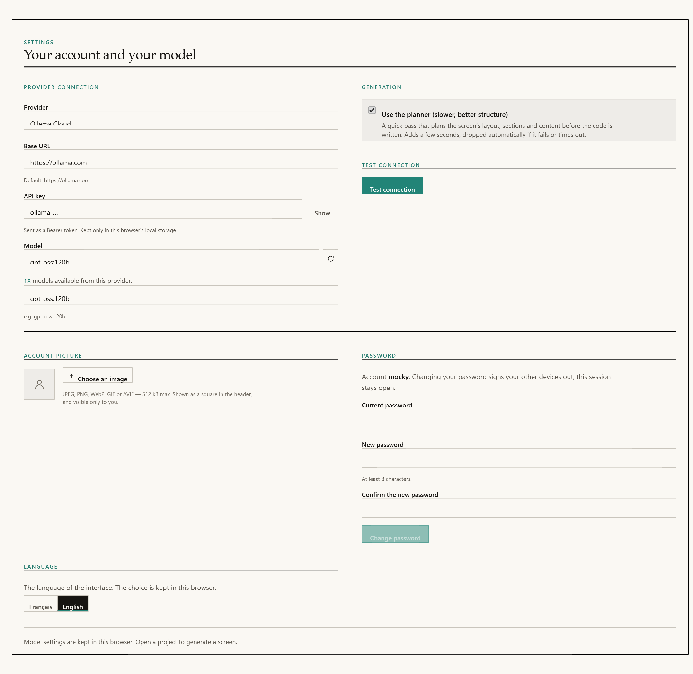
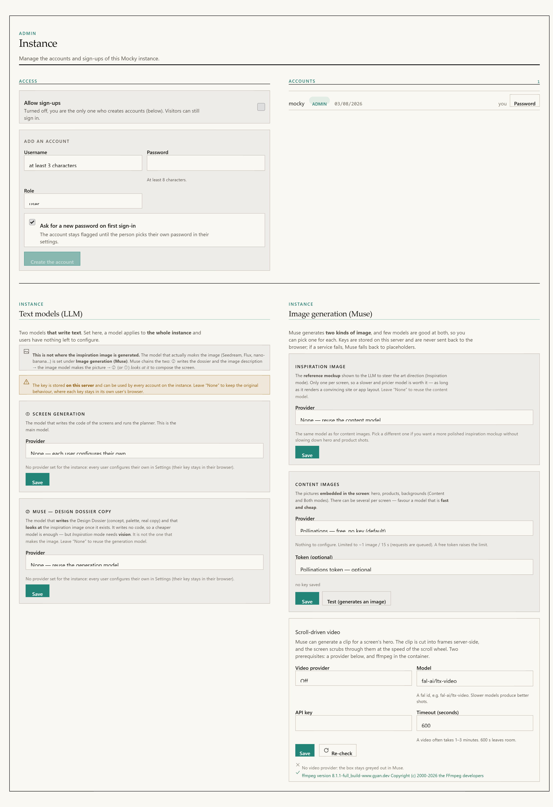

# Getting started

## Requirements

Docker, **or** Node ≥ 22.12. The `.nvmrc` file pins 22.12, which is what the
`node:22-slim` image uses. The floor moved up from 20 when the quality pass
landed: its detector requires Node 22.12+, and Node 20 left support in April
2026.

There is no database and no native module to compile.

`ffmpeg` is the only external binary, and it is used only for scroll-driven
video. Without it everything else works, and that one feature reports itself as
unavailable rather than failing.

---

## Install

### Docker

```bash
git clone https://github.com/PetitOursManu/Mocky.git
cd Mocky
docker compose up -d --build
```

Mocky listens on **http://localhost:8787**. Accounts, projects, images and video
sequences persist in the `mocky-data` volume.

The port is published on `127.0.0.1` only. Several routes spend your model
credits, so the instance is not reachable from the network until you say so. See
[Deployment](deployment.md).

### Local development

```bash
npm install
npm run dev:all
```

Then open **http://localhost:5173**.

Use `dev:all`, not `dev`. `npm run dev` starts the web server alone, with no back
end. Mocky requires an account and accounts live on the back end, so the sign-in
box will report that it cannot reach it. Muse, the media library and syncing are
unavailable in that mode too.

In development, Vite proxies `/api` and `/sso` to `http://localhost:8787`, and
serves `/__provider` itself through a middleware that imports the back end's own
module (`server/provider-proxy.js`). Both environments therefore apply the same
SSRF guard and the same allowed-subpath list.

### Production build

```bash
npm run build          # tsc && vite build  →  dist/
npm start              # Express serves dist/, the API and the proxy on :8787
```

`npm start` without `npm run build` starts successfully but every page is a bare
404. The server prints a warning, and `/api/health` answers `503` with
`frontendBuilt: false`. That is what the container health check reads.

---

## First run


*The masthead is the same on every screen: the sections on the right, then the theme switch and your account.*

1. Open Mocky. The sign-in box appears and **cannot be dismissed**. There is no
   anonymous mode.
2. Create the first account. **It becomes the instance administrator.** There is
   no password-reset flow, and promoting another account means editing
   `server/data/users.json` by hand.
3. Configure a text model. See the next section.
4. Describe a screen and generate it.


*The composer. Format first, then the three switches that decide what the model is given — the design direction, Muse, and motion.*

A project keeps **one** design direction, so its screens look like one product
rather than five sketches. It is set by the first screen you generate and then
left alone. **New direction** is the exception: tick it and the prompt you are
about to send rewrites the direction for every screen after it. It unticks
itself once that screen is generated — it is a one-off, not a mode.

Two other things travel between screens without being asked for: the product's
**name** and its **logo**. A design direction describes a palette and a voice, so
nothing in it stops a second screen inventing a second brand — which is exactly
what happened until the first screen started being shown to the model as the
identity to match. The nav, the sections and the layout stay free; pin a screen
as a layout reference (right-click a screen) if you want those fixed too.



*The home page after a first generation. The most recent project leads, with its thumbnail; projects with no screens are grouped at the bottom.*

### Account rules

| Rule | Value |
|---|---|
| Minimum username length | 3 characters |
| Password at public sign-up | 8 characters (`MIN_NEW_PASSWORD`) |
| Password created or reset by an admin | 8 characters (`MIN_NEW_PASSWORD`) |
| Session lifetime | 90 days, sliding |
| Auth rate limit | 8 attempts per minute per IP |

All three paths now ask for the same length. Public sign-up accepted six
characters — and it is the one path an attacker can reach without a session,
where on a fresh instance the account they create is the administrator.

Public sign-ups also **close themselves** once the first account exists. An
administrator reopens them from the Admin screen to invite someone.

Passwords are hashed with `scrypt` from `node:crypto` and compared in constant
time. Changing a password **revokes every session**, including the current one,
which immediately receives a fresh token.

---

## Configure a text model

There are two modes and they are mutually exclusive. The instance mode always
wins over the browser mode.

### Mode A — per browser (default)

Go to **Settings**, choose `Ollama Cloud`, set the base URL to
`https://ollama.com`, paste your API key, pick a model and press **Test
connection**.

The key is stored in that browser's `localStorage` under `mocky.settings.v1` and
is never written server-side. It passes through `/__provider` as an
`Authorization` header for the duration of each request.



*Settings. This is the per-browser mode: the key is stored in this browser only.*

This mode used to offer a single provider, Ollama Cloud — not because the others
could not work, but because the browser never told the server which dialect its
endpoint spoke. It does now (the `x-provider-kind` header), and
`src/lib/settings.ts` offers the same list as the Admin screen.

### Mode B — instance-wide (administrator)

Go to **Admin → Text models**. The key is stored on the server in
`server/data/text-config.json`, used by every account, and each user's personal
Settings are then ignored.

`server/text/config.js` declares six providers.



*Admin. A model set here is used by every account on the instance, and each user’s personal Settings are ignored.*

| id | Dialect | Default base URL | Default model |
|---|---|---|---|
| `ollama-cloud` | Ollama | `https://ollama.com` | `gpt-oss:120b` |
| `openai` | OpenAI | `https://api.openai.com` | `gpt-4o-mini` |
| `anthropic` | OpenAI | `https://api.anthropic.com` | `claude-sonnet-4-5` |
| `openrouter` | OpenAI | `https://openrouter.ai/api` | `openai/gpt-4o-mini` |
| `fal` | OpenAI, `Key` auth | `https://fal.run/openrouter/router/openai` | `openai/gpt-4o-mini` |
| `openai-compatible` | OpenAI | *(you fill it in)* | *(you fill it in)* |

`openai-compatible` covers Groq, Together, DeepSeek, Mistral, LM Studio and
vLLM — anything exposing `POST {baseUrl}/v1/chat/completions`.

### Setting up OpenRouter

1. **Admin → Text models → Generation profile → OpenRouter.**
2. Base URL: `https://openrouter.ai/api`. **Do not add `/v1`.** The dialect layer
   appends `/v1/chat/completions` itself, so an extra `/v1` produces a 404 on
   `/v1/v1/chat/completions`.
3. API key: your `sk-or-…` value, sent as `Authorization: Bearer …`.
4. Model: the full OpenRouter identifier, in `vendor/model` form. For example
   `openai/gpt-4o-mini`, `anthropic/claude-3.5-sonnet` or
   `google/gemini-2.5-flash`.
5. Press **Test**. It sends a real request through the same translation layer the
   app uses.

The test distinguishes three kinds of failure:

- a non-2xx HTTP response;
- an empty reply from a reasoning model that spent its token budget thinking;
- a reply cut short, reported as `finish_reason: length`.

**HTTP 200 with no visible text is not a success**, and the test says so. That
model would produce empty screens.

> **A common mistake.** Pasting an *image* model identifier into the text field.
> This is easy with fal, which sells both under one key. The provider answers
> "is not a valid model ID", which explains nothing. `looksLikeImageModel()`
> recognises the pattern — `text-to-image`, `flux`, `seedream`, `sdxl`, `dall-e`,
> `veo`, `kling` and similar — and shows a message that names the problem.

### The two text profiles

| Profile | Job | Receives the inspiration image |
|---|---|---|
| `generation` | Writes the screens and runs the planner | Yes. It is the profile probed for vision support |
| `inspiration` | Writes Muse's design dossier | Only when probed explicitly |

The profile travels as an `x-mocky-profile: inspiration` header. Anything else,
including no header at all, means `generation`.

Leaving the `inspiration` profile empty makes it fall back to `generation`, which
is the original single-model behaviour. The dossier writes no code, so a cheaper
model is usually enough.

Configuration files written before profiles existed are a single flat object.
`liftLegacy()` lifts them into `generation` on read, with keys intact.

### What the proxy accepts

`/__provider` forwards two subpaths and nothing else:

```js
export const ALLOWED_SUBPATHS = new Set(['/api/chat', '/api/tags'])
```

This is an allowlist, not a filter. Before it existed, a
`DELETE /__provider/api/delete` carrying `{"name":"llama3"}` reached the
configured Ollama and **deleted a model**. The body rewrite only ever replaces
`model`, so `name` passed through untouched.

Redirects are surfaced, not followed (`redirect: 'manual'`). A target that passes
the SSRF guard and then answers `302 → http://169.254.169.254/…` would otherwise
walk straight around it.

---

## Configure image generation

Go to **Admin → Image generation (Muse)**. Keys are stored on the server and
never sent back to the browser: `publicView()` replaces each one with a
`hasApiKey` or `hasToken` boolean.

The **Test** button really generates a throwaway image — a red apple on a white
background, 1024×1024 — and does not store it in the library.

| Provider | Key | Notes |
|---|---|---|
| `pollinations` | No | The default. Free and URL-based; may watermark. Limited to roughly one request every 15 seconds, so requests are queued server-side. An optional free token raises the limit |
| `fal` | Yes | [fal.ai](https://fal.ai), FLUX and similar. The synchronous endpoint is used, so prefer a fast model. The only provider that can produce **video** |
| `openai-image` | Yes | Any endpoint exposing `POST {baseUrl}/v1/images/generations`: OpenAI, LiteLLM, compatible gateways |
| `cloudflare-workers-ai` | Yes | Generous free tier. Needs an account id and a token with the Workers AI permission |
| `sd-webui` | No | Your own Automatic1111, Forge or SD.Next instance started with `--api`. Nothing leaves your machine |
| `none` | — | Muse still runs. Image slots get palette-derived placeholders |

### Two image profiles

The two jobs are genuinely different, so they have separate settings.

**`content`** produces the pictures placed in the screen: hero images, products,
backgrounds. There can be several per screen, so it should be fast and cheap.
This is the original zero-configuration path, and Pollinations is its default.

**`inspiration`** produces the single art-direction reference shown to the model.
It has to be convincing, so it is worth a slower and more expensive model.
Leaving its provider empty makes it fall back to `content`.

> `sd-webui` is called by Mocky's own server and points at a local address by
> definition, so it **deliberately bypasses** the SSRF guard applied to untrusted
> URLs. Only an administrator can set it.

---

## Scroll-driven video

Two independent prerequisites. **Admin → Image generation → Video** reports them
separately, because they are fixed in completely different places.

| Prerequisite | Detail |
|---|---|
| A video provider | `fal` only. No other configured provider has a text-to-video endpoint. The default model is `fal-ai/ltx-video` |
| `ffmpeg` | Shipped in the Docker image. Running from source, install it yourself |

`GET /api/videos/availability` returns
`reason: 'no-provider' | 'no-key' | 'no-ffmpeg' | null`, ordered by what to fix
first.

**Importing your own clip needs only `ffmpeg`** — no provider, no key, no cost.
An instance that has never configured fal can therefore use the whole feature
with its own footage.

---

## MCP servers

Local MCP servers are declared in `mocky.mcp.json` at the repository root and
spawned by the back end over stdio. The shipped file declares one server:

```json
{
  "mcpServers": {
    "fetcher": {
      "command": "npx",
      "args": ["-y", "fetcher-mcp"],
      "autoStart": false,
      "role": "inspiration-fetch",
      "idleTimeoutMs": 300000
    }
  }
}
```

The router maps semantic **roles** to whichever server exposes a matching tool,
so you can swap servers without touching code. Health is reported at
`GET /api/mcp/status`. Details are in the
[inspiration engine](muse/inspiration-engine.md) page.

A missing or invalid file is never fatal. It produces an empty server list, and
Muse falls back to its offline pattern library.

---

## Maintenance commands

```bash
npm run backup           # → backups/mocky-YYYY-MM-DD-HHmm.zip
npm run backup -- <dir>  # write somewhere else
npm run check:vendor     # verify the vendored bundles against their hashes
npm test                 # vitest run, the full suite
npm run test:watch
```

`npm run backup` is plain Node and reuses the repository's own dependency-free
ZIP writer, so it behaves identically on Windows, macOS and Linux.

For a Docker instance, copy the data out of the volume first:

```bash
docker compose cp mocky:/app/server/data ./server/data
npm run backup
```

The archive contains password hashes and session tokens. `backups/` is
git-ignored; keep it that way.

---

## Troubleshooting

| Symptom | Likely cause |
|---|---|
| Every page is a 404 but the API answers | `npm start` without `npm run build`. `/api/health` reports `frontendBuilt: false` |
| Sign-in cannot reach the back end | You ran `npm run dev` instead of `npm run dev:all` |
| `EADDRINUSE` on startup | Another Mocky is on the port. Use `MOCKY_PORT=8788 npm start` |
| Nine failed logins lock out the whole instance | A reverse proxy without `TRUST_PROXY=1`. Every request appears to come from `127.0.0.1`, so the rate limit becomes one shared bucket |
| HTTP 401 or 403 from the provider | Missing or invalid key. In instance mode the browser's key is ignored; the administrator's key is the one that counts |
| A screen is cut off mid-string | The model hit its output cap. Mocky detects this through `done_reason` or `finish_reason` being `length` and says so, instead of leaving a cryptic syntax error |
| Blank preview, console full of `origin 'null'` CORS errors | The mockup tried to navigate away from itself. The parent reloads the `srcdoc` and shows a "links are inert" notice |
| Muse does nothing | Muse requires the back end. In pure `localStorage` mode the toggle is hidden |
