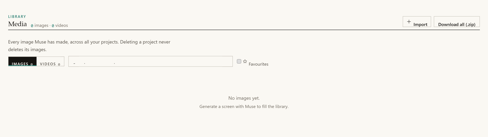

# Muse overview

## The problem Muse solves

Ask a model for "a modern landing page for a task manager" and you get the same
page every time. A purple-to-blue gradient on a dark background, a centred
headline, a subheading, two buttons, three identical feature cards with generic
icons, and a grey "Trusted by" logo strip.

That is not a rendering fault. It is the centre of gravity of the training data.

**Muse moves that centre of gravity.** Flip one toggle next to the prompt and
Mocky builds an **art direction** first, then generates the screen from it
instead of from the bare prompt.

| Without Muse | With Muse |
|---|---|
| The model invents a palette | A coherent palette, traceable to its references |
| Generic copy, often in English | Real copy, in the language of the request |
| No images, or flat colour blocks | A generated image, served from Mocky's origin |
| No record of the reasoning | A `DESIGN-DOSSIER.md` citing what inspired what |
| Nothing prevents clichés | A versioned blacklist and a self-critique pass |

Muse needs the back end. In pure `localStorage` mode the toggle is hidden — it
must never *appear* to work while doing nothing.

---

## The four stages

Muse is a **server-side** pipeline exposed at `POST /api/muse/dossier` and
orchestrated by `server/muse/inspire/engine.js`.

| # | Stage | Model calls | Optional? |
|---|---|---|---|
| 1 | **Discover** — gather inspiration | None | Yes, only when "live inspiration" is ticked |
| 2 | **Distill** — turn pages into vocabulary | One per page, at most 6 | Only runs if Discover found something |
| 3 | **Dossier** — write the art direction | One, with one retry | No, but degrades to a deterministic dossier |
| 4 | **Refine** — self-critique | One score, at most one revision | Yes |

### 1. Discover

The request is classified into tags — `landing`, `saas`, `restaurant`, `fintech`
and so on — by plain keyword matching. **No model call**, so it is testable and
works offline.

Those tags select galleries from a curated registry (`sources.json`), and any
URLs the user pasted are added. **The user's URLs come first**: their own
references always get a slot in the quota.

Pages are fetched through a **local, free MCP server** — `fetcher-mcp`, which is
Playwright plus Readability.

This stage is **optional**. It only runs when the user ticks "live inspiration".
Otherwise Muse goes straight to the dossier using its offline pattern library.

### 2. Distill

Each page becomes a structured *InspirationCard*: a palette of at most six
colours, style adjectives, typographic feel, layout grammar, motion notes,
content tone, and clichés to avoid.

The instruction is explicit: extract **vocabulary and structural grammar**, never
copy a specific design, headline or asset. If a field would identify one exact
source design, it must be generalised.

### 3. Dossier

The **design dossier** is a strict **superset of `DESIGN.md`**. Its `## Tokens`
section uses the exact `DESIGN.md` format, so `src/lib/design.ts`,
`designTokens.ts` and the whole export chain keep working unchanged.

Around that, Muse adds:

| Section | Contents |
|---|---|
| `## Concept` | Two or three sentences of **specific** art direction. "Modern, clean, professional" is banned |
| `## References` | Which reference or pattern drove which choice |
| `## Tokens` | Palette of 6 to 8 colours, typography, radius — in `DESIGN.md` format |
| `## Layout Grammar` | The composition rules |
| `## Motion Language` | The motion vocabulary |
| `## Voice & Copy` | Headline, subheadline, three value props, CTA labels, footer — **in the language of the request** |
| `## Imagery Plan` | Image slots, each with a ready-to-use generation prompt |
| `## Forbidden` | The clichés to avoid, for **this** project |

Asking the model to **cite** what drove each choice is not decoration. Traceability
is pressure towards originality.

### 4. Refine

A cheap model call scores the dossier and revises it **at most once**. It is
optional, silent on failure, and never blocks.

The result is rendered as `DESIGN-DOSSIER.md` and injected into generation as
`extraSystem` — **exactly where `DESIGN.md` already went** (invariant M1).

That slot is shared, but the two documents have opposite lifetimes, and for a
long time nothing said so: `DESIGN.md` is a document the user keeps, while a
dossier was written afresh on every generation. A project therefore accumulated
one visual language per screen. The dossier is now a **candidate** direction
rather than the authority — `resolveDirection` keeps the first one and discards
the rest, and the later runs exist for their imagery plan, the one part of a
dossier that was ever legitimately per-screen. See [D11](../adr/001-muse.md).

Full details are in the [inspiration engine](muse/inspiration-engine.md) page.

---

## How the dossier drives generation

`buildMusePreamble()` in `src/lib/muse.ts` turns the dossier into a preamble.
Three additions to the raw Markdown are worth explaining, because each fixes an
observed failure.

### The palette, restated as classes

The dossier already lists its colours — as hex values, in prose, inside a long
Markdown block. Two things went wrong every time.

The base rules named concrete Tailwind families ("slate, indigo, emerald, amber,
rose"), which is a far more actionable instruction than a list of hex values. And
nothing said **how** to apply a hex value with Tailwind.

So the model quietly fell back on indigo-and-slate, and the screens ignored the
art direction.

The fix restates each colour as the classes to paste:

```
- Accent (primary): #cc4b2f → bg-[#cc4b2f] · text-[#cc4b2f] · border-[#cc4b2f]
```

There is nothing left to translate, and the instruction is now more concrete than
the one it has to beat.

### The radius, stated without an escape hatch

> RADIUS — use `rounded-none` as the corner treatment throughout, **including when
> that means square corners**. Do not soften it.

Given `rounded-none`, a model will still round corners "to look more modern" if
the sentence leaves any room.

### The scroll sequence, stated first

It comes **before** the images and in stronger terms, because it decides the
**shape** of the screen rather than filling a slot in it. The hero stops being a
block containing a picture and becomes a pinned section the visitor scrolls
through.

A model told about it in passing writes a normal hero and drops
`<ScrollSequence>` somewhere below the fold — the one place the effect cannot
work.

---

## The three image modes



*Every image Muse generates lands in the Media library, shared across projects and searchable by the prompt that made it.*

The generated image can serve three different purposes, and it is an explicit
choice in the Muse panel.

| Mode | The image is… | Needs vision? | Image profile |
|---|---|---|---|
| `content` | placed in the screen as an `` | No | `content` |
| `inspiration` | shown to the model, **never** placed | Yes | `inspiration` |
| `both` | shown **and** placed — one image, one cost | Yes | `content` |

The saved preference is never changed silently. If the active model has no
vision, **this run** degrades to `content` and the setting stays as it was.

### Why `inspiration` does not generate the same image as `content`

It used to, and that is why the mode "often changed nothing".

An inspiration image was generated from the imagery plan's own prompt — the same
photographic subject as the hero, merely routed to a different model. That is not
an art-direction reference; it is a second hero photo. The model was handed a
picture of the product and asked to read its palette and composition from it.

A **reference plate** is a different object: no subject, no narrative, just
palette, material and light. `buildInspirationPrompt()` builds it from the
dossier's own tokens:

> An abstract art-direction reference plate. […] Composition: large flat colour
> fields, generous negative space, one clear focal area, a subtle paper or fabric
> texture, soft directional light. It is a MOOD BOARD PLATE, not a picture of a
> product: no people, no objects, no scene, no story.

The canvas records `imageRole` on the screen — `content`, `inspiration` or
`both`. The badge previously said only "Muse image", which made it impossible to
verify that inspiration mode had done anything at all.

---

## Designing from your own media

Selecting an image or a sequence from the library does more than fill a slot. The
media is read **before** the dossier is written, and the dossier is built around
it.

There are two channels, because they fail differently.

**The palette is measured from the pixels** (`src/lib/palette.ts`). It is exact,
and it works on **every** model.

Asking a vision model to describe the colours fails twice over: half the models
people self-host have no vision at all, and the ones that do return **names**
("warm terracotta") that then have to be guessed back into hex.

**The picture itself** is attached only when the model can see. It carries what a
histogram cannot: subject, composition, density, light.

The measured hex values are declared to **override** the palettes suggested by
patterns and references:

> RULES — these override the palettes suggested by any pattern or reference
> above. […] Do NOT introduce a colour family that is absent from this list. A
> page whose palette disagrees with its own hero image is the failure this
> section exists to prevent.

Without that sentence the model politely acknowledges the image and then uses the
pattern's indigo anyway — which is exactly the failure the feature exists to fix.

The media block is sanitized before it reaches any prompt or provider. See
`sanitizeUserMedia()` in the [inspiration engine](muse/inspiration-engine.md)
page.

---

## Scroll-driven video

Muse can generate a **clip for the hero** and let the visitor scrub through it
with the scroll wheel. The clip advances frame by frame, pinned full-height, and
runs backwards when you scroll up.

It is **off by default** and asked for explicitly every time. Unlike every other
Muse option, this one has a per-use price and adds minutes to a generation.
Nobody should discover that by leaving a box ticked.

### The clip is never played as a video

`ffmpeg` cuts it into a JPEG sequence — 12 fps, 960 px wide, capped at 150
frames — and the screen draws those onto a canvas. Two reasons:

1. Driving `video.currentTime` from a scroll handler looks right in a demo and
   stutters in practice. The browser has to decode from the nearest keyframe on
   every seek, and a generated clip has very few of them.
2. Frames are **images**, so the sandboxed preview needs no media source at all
   and its CSP does not move an inch to support the feature.

### A fixed sample rate, not a fixed count

Extracting "exactly 60 frames spread over the clip" would require knowing its
duration, which means a probe pass. A fixed rate needs nothing.

At 12 fps a 5-second clip gives 60 frames and a 3-second clip gives 36, and both
scrub identically because the sequence is driven by **progress**, not by time.
The 150-frame cap is what stops a surprise 30-second clip from writing 400 files.

### Two details that matter

The poster is the first frame **copied**, not re-encoded. It is what the screen
shows before preloading finishes, and it has to be byte-identical to frame 1 so
there is no visible jump.

`<ScrollSequence>` draws the **nearest already-loaded frame** rather than waiting
for all of them. Sixty frames are sixty requests, and blocking the section until
the last one lands would leave a hole for a second or two on a cold cache.

Sequences live in `data/video-library/`, addressed by the SHA-256 of the clip. An
identical request reuses the sequence instead of paying for it twice.

---

## Anti-slop

Five mechanisms, all active.

**1. A versioned blacklist.** `server/muse/anti-slop.json` names 18 clichés,
injected into the dossier prompt and merged with each inspiration card's own
`avoid` list. A sample:

> purple-to-blue diagonal gradients on a dark background · three identical
> feature cards with a generic icon, title and one sentence · a fake logo strip
> labelled "Trusted by" with grey rectangles · emoji used as UI icons · identical
> border-radius on every single element

**2. Content first.** The *Voice & Copy* section is requested before layout. A
page written around its copy does not look like a page with copy poured into it.

**3. A post-generation lint.** `lintSlop()` looks for `lorem ipsum`, "Sample
text", "Your text/content here", "Content goes here" and "Placeholder text". The
system prompt already forbade them; this makes it **enforced**. A violation does
not discard the screen — it is flagged so you can regenerate.

**4. The distinctiveness self-critique.** One score, at most one revision.

**5. The offline pattern library.** 18 hand-written art directions, each with
`DESIGN.md`-compatible token seeds. It is the fallback when live inspiration is
unavailable, and blends with the cards otherwise.

---

## Ethics and terms of service

Muse is built to respect the sites it learns from.

- **No bulk scraping.** Only the curated registry pages and the URLs you paste,
  capped at **6 fetches per run**, honouring `robots.txt`, with an honest
  User-Agent (`Mocky-Muse/…`) and a 7-day, **text-only** cache.
- **No third-party image is ever stored, cached, proxied or displayed.** Only
  Mocky-generated images and text distillations persist — and `MuseCache`
  **throws** if handed anything other than text.
- **Inspiration means vocabulary and structural grammar**, never a copy of a
  specific design.
- **Fetched web content is treated as untrusted data**, never as instructions.
- Every outbound URL passes the SSRF guard, and the default path needs **no API
  key and no account**.

These are invariants M2, M4, M5 and M7. See
[Invariants](architecture/invariants.md).

---

## Higgsfield

Higgsfield.ai has no free API, so it is not integrated. The manual workaround
works: generate the image on Higgsfield, download it, drop it into Mocky's media
library and pin it.

Muse will use it like any other image — which means measuring its palette and
writing the dossier around it.

---

## A note on dependencies

The MCP SDK pulls a few transitive packages with audit advisories: `hono`,
`body-parser`, `shell-quote` and `esbuild`. All of them are in the SDK's **HTTP
server transport**, which Mocky does **not** use. Mocky is a stdio client.

CI runs `npm audit --omit=dev --audit-level=high`, so production dependencies
only. Dev-server advisories such as Vite and esbuild do not apply to a
deployment, where Express serves the built `dist/`.
